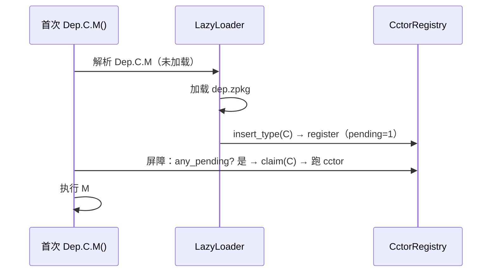
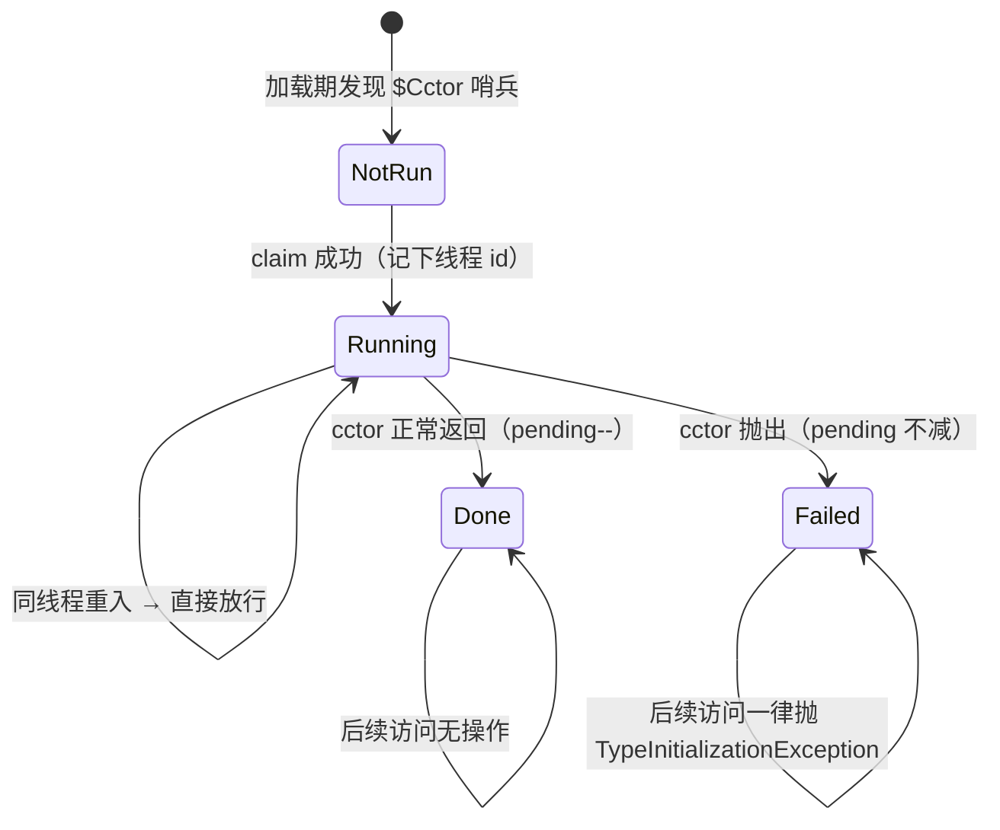

# 静态构造函数的按类型初始化

> 语义面见[静态构造函数](https://z42-lang.github.io/z42/reference/language/static-constructors.html)。本页讲实现。
> 代码：`src/runtime/src/vm_context/cctor.rs`；启动路径共用步骤 `src/runtime/src/boot.rs`。

## 为什么不能照抄 C#

C# 的静态构造器屏障之所以「零成本」，是 **JIT 在类型初始化完成后把检查从机器码里 patch 掉**。

z42 的 JIT **没有代码 patch / 失效机制**——`FnEntry` 一旦 `OnceLock::set` 就永久有效，
无 deopt、无重编译。所以屏障只能是「每次访问都检查」，问题就变成**怎么让这个检查便宜**。

## 怎么让屏障几乎免费

用一个无锁计数 `cctor_pending`（「还没跑完的静态构造器类型数」）当门：

```rust
if any_pending() { ensure_type_init(...) }   // 热路径的全部代价
```

- 程序里**没有**静态构造器 → 计数恒 0 → 屏障就是一次 relaxed load
- 有静态构造器 → 只在它们**跑完之前**付查表代价；**全部跑完后计数归零、屏障重新免费**

「无锁镜像只用于 `== 0`（可证无事可做）方向」不是新发明——旁边的
`pending_type_init_count` / `running_static_inits` 用的是同一套手法。

实际程序里门几乎总是开着：boot 时会登记 z42.core 里十几个带初始化器的类型，一个普通程序一个都用不到，
计数永远到不了 0。所以门后面还有两层按对象缓存的快路，真正决定稳态代价的是它们：

- **静态调用**：被调 `Function` 上的 `owner_init` 槽（`OnceLock`，JIT 的 `FnEntry` 共享同一个 `Arc`）。
  第一次过屏障时算出属主：从**已登记**的类型表里找（主模块 registry + 惰性加载器已装入的类型，
  **不触发加载**），只有属主有静态构造器才记 `Some(type)`，自由函数和无 cctor 类型记 `None`、此后永久免检。
  不能用会加载的 `try_lookup_type`：自由函数推出的「属主」是命名空间，它会把所有声明了但没加载的包
  逐个装进来才答「没有」（一次自由函数调用装入 16 个 stdlib 包）。只查已登记的类型就够了——
  被调函数既然拿到了，它所在的包就已加载，而包加载时类型和函数在同一把写锁里一起入表。
  基类链还没合并的类型不进缓存：加载器要靠 `Arc::get_mut` 原地补布局，多一份引用就补不动。
- **类型本身**：`TypeDesc` 上的初始化代际标记（`init_done_in(gen)`），初始化跑完后两次 relaxed load 放行。

静态字段站点仍按名字推属主（`ensure_static_owner_init`），走会加载的 `try_lookup_type`：跨包读静态字段时，
属主所在的包可能还没加载。

> ⚠️ **失败时计数不减。** 失败的类型必须让门继续开着，否则屏障短路、`Failed` 分支
> 永远检查不到，失败类型会**静默变回可用**。代价是一旦有类型初始化失败，门就长期开着
> ——那已是致命错误路径，正确性优先。

## 登记点：必须早于第一次使用

门只统计**已登记**的类型，所以「登记」必须发生在任何人能用到该类型之前；否则门读到 0，屏障被整个跳过。
登记点只有两处，都是「类型进入可见范围」的那一刻：

| 类型从哪来 | 登记点 |
|---|---|
| 主程序 + 急切合并的依赖 | 模块合并后扫一遍 type registry |
| 惰性加载的依赖包（zpkg 文件 / 内存模块） | `LazyLoader::insert_type`——**入表即登记**，两条加载路径共用这一个入口 |

加载器持有同一份 `Arc<CctorRegistry>`，在自己的写锁内登记。锁顺序固定为「加载器写锁 → registry 互斥锁」，
registry 的任何方法都不会反过来访问加载器，因此没有死锁。

**屏障必须放在「解析被调函数」之后。** 对依赖包的第一次静态调用，正是在解析这一步才加载包、登记类型的；
屏障若在解析之前检查门，这一次读到的仍是 0。interp（`exec_call::call`）与 JIT（`jit_call`）都按
「解析 → 屏障 → 派发」排列。静态字段没有这个问题：字段名在函数首次执行时预解析，预解析就会加载所属包。


```mermaid
sequenceDiagram
    participant Call as 首次 Dep.C.M()
    participant L as LazyLoader
    participant R as CctorRegistry
    Call->>L: 解析 Dep.C.M（未加载）
    L->>L: 加载 dep.zpkg
    L->>R: insert_type(C) → register（pending=1）
    Call->>R: 屏障：any_pending? 是 → claim(C) → 跑 cctor
    Call->>Call: 执行 M
```

> 惰性类型在 `insert_type` 登记（不只在 `try_lookup_type`），屏障在解析之后。否则
> 「依赖包类型的第一次使用是调静态方法」时 cctor 不执行——连带注入其体首的静态字段初始化器也不执行——而且
> 结果随「之前有没有别的类型被查过」而变。
>
> 代价：已加载但从未使用的 cctor 类型会让门常开（此后每次静态访问多一次查表）。急切路径一直如此；标准库与
> 编译器里没有静态构造器，代价只落在真正写了静态构造器的用户代码上。

## 状态机


```mermaid
stateDiagram-v2
    [*] --> NotRun: 加载期发现 $Cctor 哨兵
    NotRun --> Running: claim 成功（记下线程 id）
    Running --> Done: cctor 正常返回（pending--）
    Running --> Failed: cctor 抛出（pending 不减）
    Running --> Running: 同线程重入 → 直接放行
    Done --> Done: 后续访问无操作
    Failed --> Failed: 后续访问一律抛 TypeInitializationException
```

## 触发点与共用实现

| 触发 | interp | JIT |
|---|---|---|
| 静态字段读 / 写 | `exec_object::static_get/set` | `jit_static_get/set` |
| 创建实例 | `exec_object::obj_new` | `jit_obj_new` |
| 静态方法调用 | `exec_call::call` | `jit_call` |

**两个后端调的是同一份实现**（`ensure_static_owner_init` / `ensure_callee_owner_init` /
`ensure_type_init`）。这不是洁癖：两后端语义一致正是本特性最容易出错的地方，各写一份迟早
漂移。开发期就吃过一次——JIT 侧一度完全没有屏障，而**用户代码默认走 JIT**（只有
`__static_init__` 被强制走解释器），于是默认模式下静态构造器根本不跑。

`ObjNew` 手上已有 `TypeDesc`，所以那里**不需要门**——`td.cctor_func()` 一次
`Option` 判断就结束。

## 包级初始化：`<ns>.$Module`

`[ModuleInit]` **没有引入新机制** —— 编译器合成一个伪类型 `<ns>.$Module`，它的类型初始化器
就是包初始化器（C# 的 module initializer 本来也是 `<Module>` 伪类型的 `.cctor`）。
发射出去的东西全是既有形状：一条无字段 TYPE 记录，挂既有 `$Cctor` 哨兵 + 一个 0 参
`void` 函数 ⇒ **zbc / zpkg 格式不变**。

与普通类型初始化器的唯一区别是**谁来触发**：

| | 普通类型 | `$Module` |
|---|---|---|
| 触发 | 惰性，等访问点屏障（首次使用该类型前） | 包被加载后即跑（不等有人用到它） |
| 门 | `cctor_pending` | `module_pending`（独立计数，同一套 idiom） |

### 为什么不能在「加载那一刻」同步跑

加载发生在 `lazy_loader` 的**写锁内**。初始化器是用户代码，一执行就重入符号解析，
而解析要抢同一把锁 ⇒ 死锁。所以分成两段：

| 阶段 | 位置 | 做什么 |
|---|---|---|
| **登记** | `LazyLoader::insert_type`（每个加载进来的类型都流经的唯一漏斗，锁内） | 名字以 `.$Module` 结尾 ⇒ `register_module_init` |
| **执行** | 屏障点（静态调用 / `new` / 静态字段读写；interp ×3、JIT ×3，锁外） | `ensure_module_inits()` |

登记发生在解析该包符号的那一刻，执行发生在**同一次调用内、被调代码执行之前** ⇒ 对用户
仍是「包加载后、本包任何代码跑之前」（措辞与 CLR module initializer 一致）。

> ⚠️ **这不是加载期对全函数表的后缀扫描**（那要遍历函数数量级的表，且自成一趟）；这里判的是
> **类型**，而且搭在 `insert_type` 这个本来就要走的漏斗上，不新增任何遍历。

### 为什么它能覆盖自由函数（惰性方案覆盖不了）

cctor 屏障只有三个触发点，而 `ensure_callee_owner_init` 是靠**砍 FQ 名最后一段**推 owner
类型的 —— 自由函数推不出 owner（推出来的是命名空间，按上文只在已登记类型里找，找不到即免检），于是「只调了包里一个自由函数」这条路上，惰性方案的包
初始化器**永远不会跑**，用户看到的是空注册表而不是报错。改成「加载即登记」后，无论首次
触达走类型还是自由函数，都必然先经过 `insert_type`。守这条的是
`src/compiler/z42c.pipeline/tests/fixtures/cross-zpkg/module_init_free_function/`。

### ⚠️ 它不满足惰性化所依赖的前提

「类型初始化器惰性执行」的依据是
**已扫描 stdlib 31 个初始化器全是纯表构造、无副作用**。`[ModuleInit]` 的全部用途就是写副作用
（填注册表、开 native 库、读环境），等于正式邀请用户在初始化路径上写副作用 —— 那条前提就此失效。

缓解是设计层面的：**`$Module` 不走惰性**，它在包加载后由屏障主动触发，不依赖「有人恰好碰到
某个类」。普通类型初始化器的惰性不变。

### 失败：两个门，一个管「还没跑」，一个管「已经失败」

`refresh_module_pending` 按**真实终态**分别记两个计数：

| 计数 | 含义 | 谁来消费 |
|---|---|---|
| `module_pending` | 还有初始化器**没跑** | 任意屏障点都把它们跑掉（「加载即执行」） |
| `module_failed` | 有包处于**失败终态** | 只有**触达该包**的屏障重抛（`failed_module_owning`） |

⚠️ 不能用「`ensure_type_init` 返回了 `Ok`」判完成 —— 初始化器内部再触发屏障时，`claim`
对**同线程重入**直接放行并返回 `Ok`（C# 同款），那时它其实还在跑。按 `Done` 判定才是真的。

#### 为什么必须分成两个计数

若只有 `module_pending`、且 `Failed` 也算「未完成」（理由是「让失败无法静默变回可用」），
方向对，但代价是：这个门是**全程序级**的，屏障 `ensure_module_inits` 遍历的是**所有**
已登记的 `$Module`，与这次调用要触达谁无关。于是一个包初始化失败后：

```text
try { Touch(1); }                       // 包 Demo.MiFail 的自由函数 → 抛，catch 接住 ✅
catch (Exception e) {
    Console.WriteLine("caught");        // ← 门仍非零 ⇒ 这条也重抛 ⇒ 未捕获、进程终止 ❌
}
```

用户看到的现象是「包初始化失败的异常 `catch` 不到」。**其实 `catch` 一直是好的** ——
异常被接住了，然后在 handler 里被一条与失败包毫无关系的调用重新抛了出来。
（排查提示：`find_handler`、`catch` 类型匹配、interp/jit 两后端都是干净的。
判别办法很简单 —— **把 catch 体清空**，程序立刻正常退出。）

做法：`Failed` 从 `module_pending` 移到 `module_failed`，重抛改为带**归属判定**。

#### 归属判定：查**包的符号集合**（先确认哪个包，再无关命名空间）

屏障收一个 `sym_fq`（这次要触达的函数 / 类型 / 静态字段的 FQ 名）。判据是
`module_owns_symbol`：**这个符号在不在那个包实际拥有的符号名集合里**。集合在登记 `$Module`
时由加载方从整包的类型表 ∪ 函数表算出。

`sym_fq` 有三种形态，故先精确查、不中则**逐段剥末段**再查（命中字段 / 方法的 owner 类型）。

| 触达形态 | `sym_fq` 取自 | 位置 |
|---|---|---|
| 静态调用 / 自由函数 | 被调函数 FQ 名 | `exec_call.rs`、`jit/helpers/call.rs`（两条去路各一处） |
| `new` | 被创建类型的 FQ 名 | `exec_object.rs`、`jit/helpers/object.rs` |
| 静态字段读写 | 字段 FQ 名 | `exec_object.rs::ensure_owner_type_init` |

**本轮新跑出来的失败仍在当前屏障抛出**，不看归属 —— 初始化器是在这次调用里跑的，失败
就该在这里浮出来（与「加载即执行」和 `module_init_load_order` 钉住的语义一致）。归属判定
只管**已经失败的包**之后被再次触达。

#### 为什么不是「命名空间前缀」判据

「`<ns>.$Module` 覆盖 `<ns>.` 开头的一切」这条判据的理由是「与编译器放置伪类型的规则同源，
不会漂移」。**那个理由不成立** —— 同源的是「伪类型落在哪」，而不是「包拥有哪些符号」：
`$Module` 落在哪个 ns 由**谁写了 `[ModuleInit]` 那个 CU** 决定。两个方向都实测能踩：

| 方向 | 形态 | 后果 |
|---|---|---|
| **漏判** | 包声明了互不嵌套的多个 ns（`z42.compression` = `Std` / `Std.Archive` / `Std.Compression`），初始化器写在其中一个 | 失败后触达**同包**的兄弟 ns 不重抛，在一个初始化失败的包上继续跑 |
| **过判** | 初始化器写在裸 `namespace Std`（实测 **11 个包**都有这样的 CU：z42.core 77 个、z42.net 8 个、z42.io 6 个……）| 前缀 `Std.` 命中 `Std.IO.Console.WriteLine` ⇒ **一个包的失败毒掉另一个包**，即上面「两个计数」修掉的毒化 bug 缩小范围地回来 |

⭐ **另一个看似更好的方案也被否掉**：「不按 `$Module` 的 ns，而按包的真实符号算出 **owner
前缀集合**」。那同样救不了过判 —— 任何包的前缀集合都会含 `Std.`。

根因一句话：**命名空间在 z42 里不是包的边界**。这与 E0497 那条诊断反复强调的判据是同一件事
（「看类型的归属包，不是 `using` 的命名空间」）。所以判据只能是**成员归属**。

#### 登记为什么不在 `insert_type` 里

`insert_type` 是**逐类型**漏斗 —— 走到某个 `$Module` 时，同包的类型表还没填完、函数表也不在
手上，算不出 owner 集合。所以登记挪到**整包缝**：`lazy_loader/registry.rs` 两处循环之后
（磁盘 zpkg / 内存模块）、`seed_types_for_lookup` 之后（急切主包）。

🔴 `register_module_init` 的 owner 集合是**必填参数**：漏供的路径**编译期就过不去**，
不存在「忘了供 ⇒ 静默退回按 ns 猜」这种形态。

急切主包那条路额外收一个 `func_names`：主包自己的**自由函数**既不在类型表里、也不是任何
类型的成员，不传进来就判不出归属。

守这条的是 `src/compiler/z42c.pipeline/tests/fixtures/cross-zpkg/module_init_failure_catchable/`，判别力在最后那两行
**无关调用**上（退回修复 ⇒ 死在第一个 catch 块内部）。

#### ⚠️ 「能 catch」的前提是加载没被提前（已知偏离）

`init_static_fields` 在**启动期**调 `run_pending_static_inits()`，把「主模块里被静态字段
引用到的类」所属的包**提前加载**。于是只要程序里存在**一处**跨包静态字段引用（哪怕写在
一个从未被调用的函数里），那个包就在 `Main` 的第一条语句之前加载完毕 ⇒ 它的初始化器会在
`Main` 的**第一条调用**上触发，落在用户所有 `try` 之外 ⇒ 失败就是未捕获异常。

```z42
int ReadSeed() { return Api.Seed; }      // ← 只要有这一处引用（不必被调用）

void Main() {
    Console.WriteLine("start");          // ← 初始化器在这里跑，try 还没开始
    try { Touch(1); } catch (Exception e) { /* 到不了 */ }
}
```

C# 不会这样：它只在 `Main` 体**直接**引用依赖模块的类型时把 module initializer 提到
`Main` 之前（实测实验①）；引用写在另一个方法里则照常可 catch（实验②）。**这是一条与 C#
的真实偏离，但成因在 `run_pending_static_inits` 的加载提前，不在本节的失败语义**，
射程也更大（它影响的是「包何时加载」，不只是初始化失败）。尚未处理。

这也是上面那个 fixture 覆盖不到静态字段那条屏障的原因 —— 想触达它就必然写出一处静态字段
引用，而那处引用本身就把加载提前了。

### 编译期侧

| 阶段 | 位置 | 做什么 |
|---|---|---|
| 校验 | `SymbolCollector.CollectAll` | E0486（标注目标非法）/ E0485（包内第二个）。挂这里是因为**包编译与单文件编译两条路都经过它** |
| 合成 | `IrGen.Generate` → `ModuleInitSynth.Emit` | 本 CU 有合法站点 ⇒ 发伪类型 + cctor。per-CU 纯函数式（CU 是并行编译的） |

伪类型名**不含包名**：代码生成层（`z42c.emission`）拿不到包名（`IrDump` 是自举冻结的公开 API），而
「一个包至多一个 `[ModuleInit]`」这条约束使得 `<ns>.$Module` 整包至多一个，运行期按
后缀认即可 —— 一条语义约束顺带消掉了一处跨层参数传递。

## 编译期怎么把信息传过来

类带静态构造器时，编译器在**类级 attr-ref 块**挂 `$Cctor` 哨兵，载荷是 cctor 的**发射
函数名**（FQ）。零格式 bump（先例 `$Deprecated`）——`class_flags` 是 u8 且已用满 8 位，
没有空位可用。

载荷带函数名而不只是个布尔，是为了让运行期**不必按约定拼名**：编译期命名与运行期拼名
两处规则一旦分开写就会漂移。

`build_type_registry` 是**所有**模块（急切 + 跨包惰性）的统一漏斗，在那里读一次哨兵、
把函数名放进 `TypeDesc` 冷区，就不必给每个 type-registry 插入点各挂一遍钩子。

> ⚠️ **静态 ctor 的发射名必须与实例 ctor 区分开。** 静态 ctor 的 `RegKey` 与**无参实例
> ctor** 逐字相同（都是 `C$0`），`new C()` 查 0 参构造器会命中静态 ctor 并把它当实例
> 构造器再跑一遍。发射名因此改用 `$cctor`（`$` 非法于标识符 → 零撞名）。
> 但**只能改发射名**——`methKey` 还兼作 SemanticModel 的体查找键（body 按 RegKey 存），
> 两者一起改会让函数根本不发射。

## 字段初始化器去了哪

**有**静态构造器的类，其静态字段初始化器由编译器从按编译单元的 `__static_init__` 移出、
注入该类静态 ctor 的**体首**——这样「字段初始化器在前、cctor 体在后」的 C# 顺序才成立。

两者若分处两个函数，cctor 被触发时 `__static_init__` 可能还没跑完，会出现
「cctor 写了 42、随后 `__static_init__` 又覆写回 1」的错值。

**没有**静态构造器的类保持原样（继续走按编译单元的急切初始化）——这本来就合规，
且让屏障的代价只落在真正用了静态构造器的类型上。

## 谁来跑 `__static_init__`：两条启动路径共用一份启动步骤

> 注：静态字段初始化器并入每个类型的类型初始化器；本节的 `__static_init__` 读成
> 「合并进来的包的初始化」即可。要点是两条启动路径（`app::run` / 宿主 API）**合并后共用一份启动步骤**。

跑 z42 代码有两条入口：

- **`app::run`**：`z42vm` 二进制、`z42_run_app`、wasm `runTestApp`；
- **宿主 API**：`z42_host_load_zbc` → `z42_host_invoke`（C ABI / `z42-host`，iOS / Android / wasm 的
  `loadZbc` + `invoke` 都走它）。

两者合并模块的方式相同，合并**之后**的启动步骤必须只有**一份**：若各写一份，新增的步骤只进
`app::run` 时，宿主路径就**不执行**合并进来的包（z42.core、用户模块本身）的
`__static_init__`，带初始化器的静态字段读出的是类型默认值——而且不报错：`static_get` 读到空槽后，
`verify_static_field` 按字段类型补了个 `0`（如 wasm 上 `OSKind.Wasm` 为 0 ⇒
`Platform.IsWasm()` 恒假，所有嵌入都会中招）。

合并后的步骤只有一份，在 `src/runtime/src/boot.rs`：

| 函数 | 做什么 | 谁调 |
|---|---|---|
| `boot_context` | `available!` 折叠 → `VmContext::with_module` → 登记静态构造器 → 装 lazy loader + 种类型 / impl | `app::run`、宿主 `build_host_module` |
| `prepare_execution` | 预分配 FuncRef 槽 + `resolve_module` | `Vm::run`、宿主 `build_host_module` |

**静态字段初始化本身仍由调用方决定时机**，因为两边的「程序」形状不同：

- `Vm::run`：进入 `Main` 之前跑一次 `init_static_fields`；
- 宿主：**每个模块在首次 `invoke` 时跑一次**，放在宿主 stdout sink 守卫内（初始化器的输出也送到宿主）。
  `init_static_fields` 会先清空全部静态字段，所以绝不能跑第二次——结果存在 `HostModule.static_init`
  （`OnceLock`）。失败是**粘滞**的：之后每次 invoke 都报同一个错，而不是在半初始化的静态状态上继续跑。
  每次 invoke 结束后还要取一次 `take_static_init_error`（本次调用中首次触达、惰性加载的包的初始化失败），
  与 `Vm::run` 一致；两处都归为 `Z42HostStatus::VmException`。

> 新增启动步骤时，加进 `boot.rs`，两条路径自动都有；别再只改 `app::run`。
> 回归测试：`host::host_tests::invoke_sees_initialized_static_fields`（stdlib 包与用户模块各一个带初始化器的静态字段）。

## 已知差距

跨线程等待未实现：他线程正在跑某类型的 cctor 时，本线程直接放行而非阻塞，可能看到部分
初始化状态。C# 保证阻塞到完成。不做的原因是在持有解释器帧时阻塞极易与既有静态初始化排空
逻辑（`DRAINING` / `init_batch_inflight` 那套）互相死锁。
