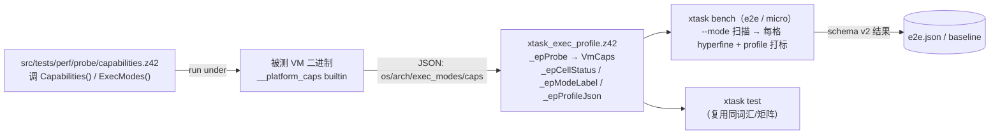

# 执行画像矩阵（exec-profile）

> 对齐：2026-09-17（change `restructure-docs-three-books`）｜ 代码：
> `scripts/common/xtask_exec_profile.z42`（共享模块：`_epProbe` / `_epCellStatus` /
> `_epModeLabel` / `_epProfileJson` / `_epScenarioRequiredCaps` / `_epCapsMissing`）、
> `src/runtime/src/corelib/platform.rs`（`__platform_caps` / `__platform_exec_modes` builtin）、
> `src/libraries/z42.core/src/Platform.z42`（`Capabilities()` / `ExecModes()` 门面）、
> `src/tests/perf/probe/capabilities.z42`（探针）、`src/tests/perf/baseline-schema.json`（schema v2）、
> `scripts/xtask_bench.z42`（消费方）。

「这次运行是在什么执行画像下测的」这句话，test 与 bench 两侧需要**同一套词汇**。
本页写这套词汇的三根轴、三值支持矩阵、以及它怎么进结果文件。
要加一个执行模式、给场景加能力门控、或者搞清楚「为什么这条基线不跟那条比」时读它。

## 1. 问题

z42 VM 有多个执行模式（interp / jit，未来 aot）、多平台（desktop × {x64, arm64}、wasm、iOS、
Android）、多能力。**测试侧**早就把「模式」做成一等维度（`test e2e --mode interp|jit`），
**基准侧**却长期只测 VM 的默认模式——有 JIT 却从不量化「JIT 比 interp 快多少」，
而且 baseline 无从分辨自己是在哪种模式 / 平台 / 能力下测的，**跨环境的数字会悄悄互比**。

解法是把三根轴收敛成**一个描述符 + 一张支持矩阵**，test 与 bench 都消费它。

## 2. 三根轴

### 2.1 mode —— 执行**组合**，不是标量

```
mode = { tiers: [...], aot_pkgs: [...] }
```

- `tiers`：本次运行活跃的后端集。`interp` 恒在（兜底），可 `+jit`。
- `aot_pkgs`：被预编到 AOT 的 zpkg 逻辑名子集。

这个形状是从 [AOT 设计](../runtime/aot.md) 反推来的：AOT 是**按 zpkg 为单位、可部分**的
（随包静态 zpkg 走 AOT，动态加载的走 interp/jit），且与 JIT/interp 共存。
因此「full AOT」在有 JIT 的平台上**根本不是常态——混合才是常态**。

于是纯 interp / 纯 jit / 部分 AOT / 全 AOT / 「混合执行」全是**同一形状的不同取值**，无特例分支：

| 场景 | `tiers` | `aot_pkgs` |
|---|---|---|
| 纯 interp | `[interp]` | `[]` |
| 纯 jit | `[interp, jit]` | `[]` |
| 部分 AOT（desktop） | `[interp, jit]` | `[z42.core]` |
| iOS 全随包 AOT | `[interp]` | `[z42.core, app]` |

> **「混合执行」就此消解**：它不是第四个枚举值，而是 `aot_pkgs ≠ []` 或 `|tiers| > 1` 的一般情形。
> 这是这套建模最值钱的一点——别把它退回成标量。

`_epModeLabel` 给出可读形式兼 diff 键：`interp` / `jit` / （未来）`jit+aot[z42.core,z42.math]`
（`aot_pkgs` 排序后拼接，稳定）。

### 2.2 platform —— `{os, arch}`

`os` 取 `Std.Platform.OS()`（linux / macos / windows / wasm / ios / android）；
`arch` 归一化为 `x64` / `arm64` / `wasm`。**结构化而非拼成一个串**，是为了 `--diff` 能按轴分组。

### 2.3 caps —— 运行时返回的属性

`caps` **不静态推断**，而是 `Std.Platform.Capabilities()` 在**被测 VM 二进制**下返回的真实能力
（当前：`jit` / `native-interop` / `bundled-compression` / `threads` / `socket`）。
`Std.Platform.ExecModes()` 另报可派发后端（`interp` 恒在，`jit` / `aot` 按 cfg）。
两者由 `corelib/platform.rs` 的 `__platform_caps` / `__platform_exec_modes` 背书，
读 `cfg!(feature = …)`，`threads` / `socket` 另按 `cfg!(not(wasm32))` 补。

> **caps ⟂ mode 正交**：caps 回答「这个二进制**能**做哪些后端」；mode 回答「这次**用了**什么」。
> 一个 desktop 二进制的 caps 恒含 `jit`，但某次 run 的 mode 完全可以是纯 interp。

同一套 `Capabilities()` 也被 runner 的 `[Skip(feature:)]` 判定消费
（见 [测试框架机制 §3.3](framework.md)）——能力只有一个真相源。

## 3. 支持矩阵（cellStatus）

`_epCellStatus(tiers, aotPkgs, vmExecModes)` 三值：

| 值 | 条件 | 含义 |
|---|---|---|
| `skipped-not-yet` | `aot_pkgs ≠ []` 或 `tiers` 含 `aot` | 框架能表达但执行未实现（归 M9）。**不论平台、不论 aot feature 是否编入** |
| `never` | `tiers` 含 `jit` 但被测 VM 的 `exec_modes` 无 `jit` | 这个二进制物理上跑不了（如 wasm / mobile 的 interp-only 构建） |
| `runnable` | 其余 | 今天可跑并记结果 |

判据的优先级写死在这个顺序里：**运行时实况（`exec_modes` / `caps`）是地面真值，
静态矩阵只做策略覆盖**。唯一的例外就是 aot——即便编进了二进制，执行仍是 stub，
所以由策略层无条件标成 `skipped-not-yet`。

非 `runnable` 的格子由 harness **显式打印跳过原因**，绝不静默丢。

## 4. 数据流



harness 对**要测量的那个 VM 二进制**跑一次探针，缓存 `VmCaps`，据此判 cellStatus（跳非 runnable）
并给每条结果打 `profile`。

> 探针的失败必须能与「探针说这台机器没有 X」区分开。`_epProbe` 曾经忽略编译器退出码，
> 于是任何解析不了的输出都被当成一份"空 profile"——错误被伪装成了事实。

## 5. schema v2

`src/tests/perf/baseline-schema.json`（`schema_version: 2`）：顶层去掉扁平的 `os` 串、
加 `z42vm_version`；每条 benchmark 必带

```json
"profile": {
  "mode": { "tiers": ["interp","jit"], "aot_pkgs": [] },
  "mode_label": "jit",
  "platform": { "os": "linux", "arch": "x64" },
  "caps": ["jit","native-interop","bundled-compression","threads","socket"]
}
```

**`--diff` 按 `(name, metric, mode_label@os/arch)` 匹配**——interp-vs-jit、跨平台**绝不互比**。
这是整套东西存在的理由：没有 profile 时，两条来自不同模式的数字长得一模一样。

### 5.1 派生展示：jit/interp 加速比

`--diff` 尾部对同一 `(name, metric, platform)` 下**同时**有 interp 与 jit 结果的场景，
派生打印一节 `Speedup (interp/jit, >1 = jit faster)`（即 `interp.value / jit.value`）。
**派生展示，不入 schema、非回归信号**——它是给人看的，不是门禁判据。

### 5.2 场景能力门控

场景可在源码顶部注释声明所需能力：

```z42
// requires-caps: threads
```

`_epScenarioRequiredCaps` 解析它；e2e 探到被测 VM caps 后，
`_epCapsMissing(required, vmCaps.caps)` 非空 → **显式跳过该场景**（不静默、不崩）。
这让无线程的 VM（wasm / mobile）安全略过 `06_thread_scaling` 这类场景，为平台 bench 铺垫。

场景另有一行 `// tier: gate|full` 决定它是否进 PR 门禁那一组（`xtask bench --tier gate`）；
未声明按 `full` 记。两条注释是两个正交的过滤器，别混。

## 6. 现状边界

- **AOT 组合格子只建模、不执行**：今天 harness 恒发 `aot_pkgs: []`，任何
  `aot_pkgs ≠ []` 的组合返 `skipped-not-yet`。AOT 执行 + 它的 per-zpkg 配置面（z42.toml / CLI）
  归 M9；届时把 skipped 列翻成 runnable + 加配置解析即可，**schema 的 `{tiers, aot_pkgs}` 结构不动**。
- **平台 bench 的编排未接**：profile 机制本身已平台就绪（探针在任意平台的 VM 下都报真实 caps），
  但各平台的 bench harness 编排是大面（需各平台重型工具链验证，且它是 informational 而非门禁）。

## 7. 在哪改

| 要改什么 | 改哪 |
|---|---|
| 加一种 cap | `corelib/platform.rs::builtin_platform_caps`（cfg 分支）；消费侧自动跟随 |
| 加一种 exec mode | `builtin_platform_exec_modes` + `_epCellStatus` 的策略覆盖分支 |
| mode_label 拼法 | `_epModeLabel`（**它是 diff 键，改了等于让历史基线对不上**） |
| profile 进结果的形状 | `_epProfileJson` + `src/tests/perf/baseline-schema.json`（要 bump `schema_version`） |
| 场景的能力要求 / 门禁分层 | 场景源码顶部的 `// requires-caps:` / `// tier:` 注释 |
