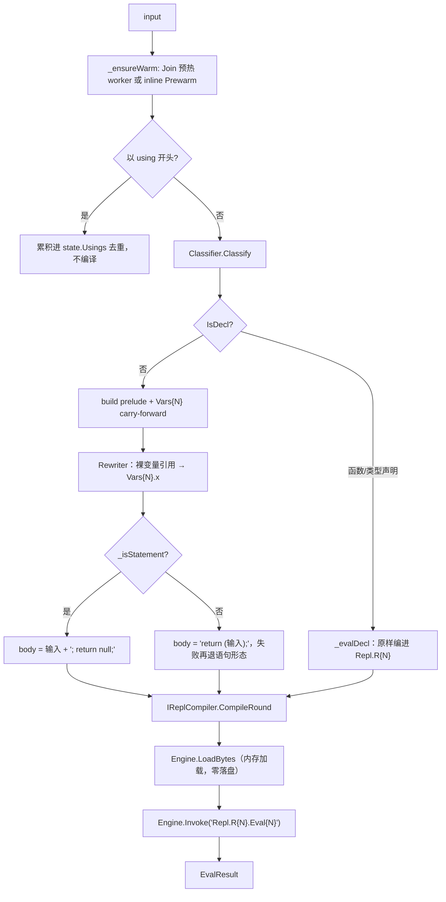

# REPL 实现（z42i / z42.scripting）

> 对齐：2026-09-17（change `restructure-docs-three-books`）｜ 代码：
> `src/libraries/z42.scripting/src/`（eval-core）、
> `src/toolchain/interactive/core/interactive_main.z42`（宿主主循环）、
> `src/toolchain/interactive/repl/src/`（tty 行编辑绑定 + 键位策略）、
> `src/libraries/z42.build/src/IReplCompiler.z42`（编译门面）、
> `src/compiler/z42c.pipeline/src/Z42cReplCompiler.z42`（门面实现）、
> `src/runtime/crates/z42-repl/`（行编辑 cdylib）、
> `src/runtime/src/corelib/repl.rs` · `repl_native.rs` · `repl_editing.rs`（VM 侧 builtin）、
> `src/toolchain/launcher/core/launcher_cli.z42`（`z42 repl` 转发）。
>
> 要查**怎么用** `z42 repl`（旗标、元指令）→ 敲 `z42 repl -h`，或语言与库参考的工具链部分。

本页写 REPL 是**怎么实现的**：一行输入从按键到结果值要穿过哪几层、会话状态凭什么跨轮存活、
「写完了没」由谁判定、编译器为什么是运行期注入进来的、首轮延迟是靠哪几层惰性压下去的。
改 REPL 行为、加元指令、动补全或多行编辑时读它。

## 1. 分层：四个包 + 一个 cdylib

```
z42 repl                                  launcher（特判命令，不走生成式 help 路由）
  └─ z42vm programs/z42i/z42.interactive.zpkg
       ├─ z42.interactive (Z42Interactive)   宿主：主循环 / 元指令 / 结果打印
       ├─ z42.repl        (Std.Repl)         tty 交互层：native 绑定 + 键位策略        ← toolchain
       │    └─ libz42_repl.{dylib,so,dll}    rustyline 行编辑器（host-only cdylib）    ← runtime
       └─ z42.scripting   (Std.Scripting)    跨平台 eval-core：分类/改写/完整性/编译编排/补全 ← stdlib
            └─ z42.build  (Z42.Build)        IReplCompiler 门面（只有接口）
                 └─ z42c.pipeline            Z42cReplCompiler（运行期反射注入）
```

切法只有一条准则：**平台绑定重的留 toolchain，跨平台的下沉 stdlib**。

| 包 | 命名空间 | 住处 | 分发落点 | 为什么在这一层 |
|---|---|---|---|---|
| `z42.scripting` | `Std.Scripting` | `src/libraries/` | `libs/z42.scripting.zpkg` | 纯计算，无 tty 依赖；playground / wasm 复用同一份 eval-core（`Playground.z42` 的 `evalFromVfs` 就是它的 VFS 入口） |
| `z42.repl` | `Std.Repl` | `src/toolchain/interactive/repl/` | `programs/z42i/z42.repl.zpkg` | 绑 tty / rustyline，host-only |
| `z42.interactive` | `Z42Interactive` | `src/toolchain/interactive/core/` | `programs/z42i/z42.interactive.zpkg`（apphost `z42i`） | 交互入口本体 |
| `libz42_repl` | — | `src/runtime/crates/z42-repl/` | `programs/z42i/`（挨着 z42i） | 行编辑后端，见 §5 |

依赖是**单向**的：`z42.repl` → `z42.scripting`（用 `Completeness`），反向没有边。会话变量活值的成员名
反射（补全要用）因此归 `Std.Scripting.Engine.MemberNames` 而不是 `Std.Repl.Repl`——放错边就成环。

`z42 repl` 在 launcher 里是**特判命令**（`launcher_cli.z42:28`）：`_forwardRepl` 自己拦 `-h`/`--help`
打印帮助（跳过 `-c` 的值，故 `z42 repl -c "-h"` 仍是求值），其余参数里剥出 launcher 级的
`--mode`/`--config`/`--set` 转成 z42vm 的参数与 `Z42_CONFIG` 环境变量，剩下的透传给 z42i。

转发链必须 `.ShareProcessGroup()`。`Process.Run()` 默认把子进程放**独立进程组**（为 run-timeout 树杀），
而独立进程组对控制终端是**后台组**——z42i 拿不到 tty，行编辑器初始化失败（没有 `>>>`），后台读 tty
还会触发 SIGTTIN 阻塞。管道模式无 tty 不触发，直跑 `z42i` 单层 spawn 天然在前台组，所以这个坑只在
「launcher 转发 + 真终端」这一格里出现。

## 2. 一轮 eval：从字符串到装箱值

`Script.Eval(state, input)` 的主干（`z42.scripting/src/Script.z42`）：



### 2.1 每轮一个命名空间

第 N 轮编出的是一个完整的单文件 package `repl_r{N}`，命名空间 `Repl.R{N}`，入口是**自由函数**
`Eval{N}`（实测类方法作 entry 解析不到，故一律自由函数），经 `__invoke_static` 按 FQN 调。
声明轮没有 `Eval{N}`，只加载不调用。

`prelude` 由 `_basePrelude` 拼出：`namespace Repl.R{N};` + 累积的 `using` + **每个已登记的声明命名空间**
的 `using Repl.R{k};` + 当前 `Vars` 轮的 `using`。所以后续轮能裸调前面定义的函数、裸用前面定义的类型。

### 2.2 会话变量 = `Vars{N}` 类的静态字段

变量不存在宿主的某个 map 里，而是**提升成 VM 里的静态字段**，值天然跨轮存活：

- **只有 var 声明轮**发新的 `Vars{N}` 类，carry 前轮全部变量（`public static var v = Vars{prev}.v;`）
  再追加新变量，然后 `state.VarsRound = N`。
- **非声明轮**（表达式 / 语句 / 赋值）**不发新类**，直接引用现有的 `Vars{VarsRound}`——赋值就地改它的
  静态字段。这条是长会话保持恒定速度的关键：否则每轮都累积一个包，成本按会话长度线性涨。
- 用户输入里对变量的**裸引用**必须改写成限定形式：z42 的静态方法/初始化器不能不加限定引用类静态字段
  （会报 E0401）。`Rewriter.Rewrite` 用 `Z42.Syntax.Lexer` 做 token 级改写——identifier 命中变量名、
  且前一个 token 不是 `.`（排除 `obj.x` 成员访问）就前缀 `Vars{N}.`，其余原文（空白/注释/字符串）逐字保留。

变量声明保留用户写的**显式类型文本**（`ParsedInput.DeclType`）发字段（`A a = new()` → `public static A a = …`），
这样 target-typed `new` 和集合字面量能从声明类型定型；写 `var` 的仍发 `var`，靠 init 推断 + carry 保型。

### 2.3 表达式 / 语句两条 body 形态

分类器判不出「这是语句」时走**表达式优先**：先编 `return (X);`，有错再编 `X; return null;`（`hasValue=false`）。
`_isStatement` 是个保守的 token 级快筛（首 token 是语句关键字，或括号深度 0 处出现赋值/自增符），
命中就直接走语句形态、省一次编译。漏判只是退回老路仍正确；**误判**才会吞掉返回值，所以它只认这两类强信号。

包裹前要**剥掉输入末尾的单个 `;`**。不剥的话两条路同时炸：表达式路径得到 `return (X;);`（E0202），
语句路径得到 `X;; return null;`（`;;` 空语句 parser 拒），该轮副作用全丢。多语句 `a();b();` 的中间 `;`
保留、只剥尾随，回退路径 `a();b(); return null;` 自然合法。

### 2.4 顶层声明累积

函数 / 类型声明**原样**编进 `Repl.R{N}`——不裹壳类、不改写函数体（所以声明体里裸引用会话变量会
E0401，见 §8）。成功后三件事：`IReplCompiler.ExtendWorld` 把刚编出的字节增量并入编译世界、
`Engine.LoadBytes` 加载进 VM、`Repl.R{N}` 记入 `state.DeclNamespaces` 供后续轮 `using`。

一个反直觉的补丁：**缺省未写可见性的类型声明自动前缀 `public`**（`Script._evalDecl`，据
`ParsedInput.HasVisibility`）。类型默认可见性是 `internal`，而 REPL 每轮是独立 package，裸
`class Foo { public int X; }` 会双重踩雷——同轮 `internal` 类含 `public` 成员报 E0441，下一轮跨 package
引用报 E0404。显式写了 `internal`/`public` 的尊重用户；自由函数不需要（跨包 internal 自由函数本就可用）。

同名重定义直接报错（`DeclNames` 查重），不做 supersede——遮蔽旧定义需要会话内符号版本化 + 旧包退役，
否则跨轮解析会 first-wins 串味。

一个跨组件的小协议：声明轮的包 `repl_r{N}` **只在内存加载、从不落盘**，但后续轮引用它的类型时编出的
依赖项仍按规范文件名 `repl_r{N}.zpkg` 记录。VM 的 lazy loader 在加载任一包时把 `<包名>.zpkg` 记进
**驻留集**（`lazy_loader.rs` 的 `loaded_zpkgs`），依赖解析循环在驻留集命中即短路——否则它会对一个从不存在的
`repl_r{N}.zpkg` 发起磁盘查找并刷 `WARN: cannot read dep zpkg meta`，而引用其实经进程内已加载的模块解析得好好的。

### 2.5 错误恢复：两类失败，两种处理

| 失败 | 会话怎么走 | 为什么 |
|---|---|---|
| **编译错误** | `Success=false`，`Counter` **不**前进，`State` = 传入的原状态 | 本轮什么都没加载进 VM，轮号可以重用 |
| **求值期运行异常**（`throw` / 除零 / 越界 / `int x = "s"` 之类的装箱类型不符） | `Success=false`，但 `Counter` **必须**前进；不 `ExtendWorld`、不推进 `VarsRound`/`VarNames` | 本轮模块 `Repl.R{N}`（含那个抛出的 `Eval{N}`）**已经 LoadBytes 进 VM 了**。不前进轮号 → 下轮重编同名 `Eval{N}` 覆盖不掉 VM 里的旧函数 → 异常"粘住"，后续每条输入都复现它 |

异常在 `Engine.Invoke` 外层 catch 住、绝不逃逸终止 REPL。`ExtendWorld` 放在 Invoke **成功之后**：
本轮 Invoke 只依赖已 LoadBytes 的模块，不需要先扩世界；失败轮就不并入，编译世界不被污染。

### 2.6 诊断行号回映

用户输入被包进生成源（prelude + wrapper），诊断原本报的是生成源坐标 `repl_rN.z42(17,9): …`——对用户毫无意义。
`Script._remapDiag` 把每条诊断的行回映为 **用户行 = 诊断行 − prelude 换行数**（表达式轮 / 声明轮同一基准），
丢掉内部文件名和列号（`Rewriter` 改写会移列，列号不可靠）。用户行 ≤ 1（单行输入）→ 只留 `E0401: undefined: x`；
多行块 → `第 N 行: <msg>`。格式不符就原样返回。

## 3. 编译门面 + 运行期注入

REPL 把编译器当**有状态的增量服务**用：依赖世界跨轮缓存、逐轮增量并入、按类型惰性 reconcile、
E0401 回退重编，补全还要遍历导入世界。这些逻辑天然属于编译器，但如果让 `z42.scripting`
直接静态依赖 `z42c.semantics`/`z42c.pipeline`，一个 stdlib 包就把整个编译器后端焊死在编译期依赖里了。

解法是 DIP：**`z42.build` 只放接口，`z42c.pipeline` 实现它，`z42.scripting` 运行期反射注入拿实现**。

`Z42.Build.IReplCompiler` 六个 coarse 方法，参数与返回**只有 `string[]` / `byte[]` / `int`**，
「有状态增量编译世界」封成 opaque `object` 句柄——`z42.build` 的依赖面因此零增长：

| 方法 | 职责 |
|---|---|
| `CreateWorld(libsDirs, n, declaredDeps, m) → object` | 建依赖世界骨架（`DepScan.ScanDirsLazy`：路由 nsMap + 惰性 world，不预 reconcile） |
| `CompileRound(world, name, src, usings, n) → ReplCompileResult` | 编一轮源 → packed zpkg 字节 + **原始**诊断；内部含 E0401 的两级回退重试（§6.4） |
| `ExtendWorld(world, bytes, pkgName)` | 声明轮增量并入世界（carry-forward） |
| `NamespaceNames(world) → string[]` | `.using` 补全的全量 ns 名 |
| `ScopeTypeNames(world, activeNs, n) → string[]` | 作用域候选 = 已 reconcile 顶层符号 ∪ 活跃 ns 内「索引已知但未 reconcile」的类型短名 |
| `StaticMembersOf(world, typeName, activeNs, n) → string[]` | `Type.` 静态成员（按需 reconcile 后遍历） |

实现侧 `Z42.Pipeline.Z42cReplCompiler` 的 opaque 句柄是 `ReplWorld`（bundle `DepScanResult` + 编译配置），
复用 `PackageCompile` / `DepScan` / `IrDump` 核心。私有 helper 全 static（无实例态）。

`ReplCompilerHost.Get()` 负责注入，惰性单例：`ModuleLoader.Load(z42c.pipeline.zpkg + 依赖闭包)` →
`Type.GetType("Z42.Pipeline.Z42cReplCompiler")` → `Activator.CreateInstance` → `as IReplCompiler`。
组件定位序（`_findCompilerZpkg`）：

1. `Z42_HOME/programs/z42c/`（SDK 安装态；launcher 转发时已设）
2. `Z42_PORTABLE_VM` 反推 SDK 根
3. 开发树 `artifacts/build/compiler/z42c.driver/release/dist/`
4. `Z42_LIBS` 目录——比 z42b 多这一兜底，覆盖 dev 回路与「编译器组件与 stdlib 同置一处」的场景

任何一步失败都不抛，退化成 `NoReplCompiler`（编译恒失败、补全恒空）——runtime-only SDK 装不上编译器组件时，
REPL 仍能启动并给出明确的 stderr 提示，而不是崩。

> `Z42_LIBS` 在 `Script.Create()` 里当**单个目录**读，**不按 `:` 拆**。拆了会让第二段目录里的包编得过、
> 运行期却加载不到（`MissingSymbolException`），且 Windows 的 `C:\…` 会被盘符冒号截断。
> wasm/playground 无环境变量，走 `Script.CreateWithLibs("/libs")` 显式传 VFS 目录。

## 4. 输入完整性：判定权威是 parser

REPL 每读一行都要回答「当前累积的输入写完了没」。早期靠括号净深度，那只是完整性的一个**词法子集**：
`class B`（缺正文）、`void foo()`（缺 `{`）、`1 +`（缺右操作数）括号计数全是 0，被误判成写完，直送编译报错。

唯一知道语法上还缺什么的是 **parser**。`Std.Scripting.Completeness.IsIncomplete` 因此对输入做一次
**裸 parse**——不做语义分析 / codegen / 加载依赖 / 执行，不改 `ScriptState`，只读 parser 的标志位。

### 4.1 为什么必须是裸原文

直觉方案是「试编译包裹后的代码，报 EOF 就续读」。但 z42 无顶层语句语义，求值时输入会被包进
`return (…)` / 函数体，**包裹尾部的 `)` `}` `;` 会接住本该落到 EOF 的缺失点**：

| 输入 | 送进 parser 的文本 | 缺失点的下一个 token | 能判不完整 |
|---|---|---|:-:|
| `1 +` | `return (1 +);` | `)` | ❌ 永不置位 |
| `1 +` | 裸 `1 +` | EOF | ✅ |

所以完整性判定与求值是**两条路**，只共享 `Classifier`。探针不走 `PackageCompile`，信号也就只需要挂在
parser 的 `DiagnosticBag` 上，不必透传到 `CompiledModuleZ` / `CompileArtifacts` / `EvalResult`。

### 4.2 两个标志，按入口取舍

`DiagnosticBag` 上有两个 bool。置位判据是「**当前 token 已是 EOF，且此前无真语法错**」——与具体诊断码无关；
EOF 分支统一报 `E0203`（`DiagnosticCodes.UnexpectedEof`），非 EOF 仍报原码。

| 标志 | 置位点 | 覆盖 |
|---|---|---|
| `IncompleteAtEof` | `Parser.z42:183`（`_expect`）、`Parser.z42:207`（`_errorOrIncomplete`） | 缺 `{ } ( ) [ ]`、缺类型名/函数名（`DeclParser`）、缺操作数（`ExprParser`） |
| `IncompleteSemiAtEof` | `Parser.z42:195`（`_expectSemi`） | 只有「缺 `;`」这一种 |

**「此前无真错」这一条是必需的**：真语法错解析恢复后也会走到 EOF，若不加这条，`class 1`（已报
expected type name）会被当成没写完而挂起等续行。

**`;` 必须拆成第二个标志**，因为它的续读语义按入口相反：

| 入口 | parser 入口 | 续读条件 |
|---|---|---|
| 声明（`ParsedInput.IsDecl`） | `ParseCompilationUnit` | `IncompleteAtEof \|\| IncompleteSemiAtEof`——`void foo()` 缺 `;` 也要续读补 body |
| 表达式 / 语句 | `ParseStatement` | 仅 `IncompleteAtEof`——REPL 表达式 `42` 本就没有 `;`，若也续读会无限吃后续输入、永不求值 |

### 4.3 悬挂运算符是语法真相的产物

`1 +` 单独回车是否续读，取决于该语言**是否把换行当 token**：Node / C# / Ruby / Scala 续读（换行不敏感），
Python 报错（NEWLINE 是 token，`1 +\n` 本身非法）。z42 与 C#/JS 同属「换行不敏感、分号结尾」，所以
`1 +` **续读**——这不是 REPL 额外加的规则，而是 parser 权威下语法真相的自然产物。这正是选 parser 权威
的核心收益：**续读行为永远自动跟着语法走**，加新语法不必回头维护第二套续读规则。

### 4.4 续行缩进纯装饰

`Completeness.ContinuationIndent(buf)` 用既有 `Lexer` 数 `buf` 仍未闭合的括号层数，返回 `层数 × 4 空格`。
用 Lexer 而不是自己扫字符：它天然跳过注释，并把字符串/字符字面量里的括号锁在 token 内不计。
缩进对 parser 是纯空白、无语义影响——`IsIncomplete` 才是权威。native 侧因此**不再保留任何括号状态机**。

### 4.5 两条读取路径

| 模式 | `Repl.ReadLine` 返回 | 多行从哪来 |
|---|---|---|
| 交互（tty） | **整条**语句（可含 `\n`） | 回车 handler 在**一次** readline 内插换行 + 缩进，直到整块完整才提交（§5.2） |
| 非交互（管道 / 无 tty） | 一个物理行 | 宿主 `buf` 逐行累积 + `IsIncomplete` 判续读 |

`interactive_main` 的 `buf` 累积因此**保留**——非 tty 靠它；tty 下整块一轮即完整，`buf` 只是透传。

逃生：`-c` 无续读来源，`IsIncomplete` 为真直接当语法错、非零退出（实测
`z42 repl -c "1 +"` → `error: unexpected end of input (incomplete code passed to -c)`，rc=1）。
Ctrl-C 在 cdylib 侧归一成**空串**（循环 continue，弃当前输入回主提示符，Python 式重来），
Ctrl-D 归一成 **null**（循环 break，退出）——见 §5.1。

## 5. 行编辑层

### 5.1 边界：dlopen 的 host-only cdylib

rustyline 后端不在 z42vm 里，而是独立 crate `z42-repl` 编出的 `libz42_repl.{so,dylib,dll}`，
**挨着 z42i 放**（`programs/z42i/`），由 `corelib::repl_native` 的 REPL 专用惰性 loader 在首次
`__repl_readline` 时 dlopen——不走通用的 `native_search_paths()`。wasm / mobile 永远不加载它，
落回纯 stdin 读取。产物由 `z42.repl` 自己的 build hook（`repl/hooks/hooks.z42` 的 `ProvideNative`）
`cargo build -p z42-repl` 产出并登记，消费方 publish 时沿 path-dep 闭包自动平铺进 payload。

边界是**纯 C ABI**：没有任何 z42 内部类型（`Value` / `VmContext`）穿过去。反向的 VM 重入
（补全候选、键位决策）靠一张 `ReplCallbacks` 函数指针表，`ctx` 是不透明的 `*mut VmContext`，
cdylib 只原样传回、从不解引用。候选以 `\n` 拼接的 C 字符串穿越。这让 crate 对 z42 主 crate
零依赖（无 Cargo 环）。

VM 侧只剩三样：`__repl_*` builtin、重入核心 `complete_via_callback`、以及 cdylib 回调进来的
`extern "C"` trampoline。

返回值约定：读到行/整块 → `Value::Str`；Ctrl-D（EOF）→ `Value::Null`（z42 侧据此退出）；
Ctrl-C（中断）→ `Value::Str("")`；空行也是 `Value::Str("")`。编辑器初始化不了（无 tty）
→ 专门的 `Z42_REPL_NO_EDITOR` 码，让 VM 侧落回 `plain_readline`，而不是当错误上报。

### 5.2 键位策略在 z42，Rust 只做适配壳

rustyline 在 Backspace / Tab / `}` / Enter 上回调 z42 的 `Std.Repl.ReplEditing.KeyEdit(key, line, pos)`
（与 Tab 补全同款重入路径），z42 返回一个**动作串**，Rust `parse_action` 照译成 rustyline `Cmd`：

| 动作串 | `Cmd` | 用于 |
|---|---|---|
| `""` | 该键默认（Tab→补全、退格删 1、`}`→插入） | 有词 / 非缩进行 |
| `dedent` | `Dedent(WholeLine)` | 退格去一级（`indent_size`=4） |
| `insert:<text>` | `Insert(1, text)` | Tab 网格吸附：补到下一个制表位 |
| `replace:<text>` | `Replace(WholeLine, text)` | `}` 自动回退 / 退格 floor（变量宽度删+插） |
| `accept` | `AcceptLine` | Enter：整块写完 → 提交 |
| `newline:<ind>` | `Insert(1, "\n"+ind)` | Enter：整块没写完 → 缓冲内插换行 + 续行缩进 |

介入前提**按键分档**：Tab / `dedent` 只要求光标前缀全为空格；`}` / 退格 floor 额外要求**整条逻辑行
纯空白且光标在行尾**——`Replace(WholeLine)` 替换整行，必须确保被替换内容里没有有意义字符。
任何情形不满足一律走默认键行为。

- **Tab 网格吸附**：补 `((col/4)+1)*4 - col` 个空格（`col=2` → 4，不是 6）。
- **`}` 自动回退**：目标缩进 `max(0, floorToStop(col) - 4)`，动作 `replace:<缩进>}`——dedent 一级后落 `}`。
- **退格 floor**：缩进错位（`col%4≠0`）时 floor 到前制表位（`col=6` → 4，一键归正）；对齐时 floor 恒等于
  删一级，仍走通用的 `dedent`。

**Enter 的分工是刻意的**：z42 答「代码写完没」（`Completeness.IsIncomplete` 对**整块缓冲**判定），
Rust 答「光标在末尾没」（`ectx.pos() == ectx.line().len()`，字节比较，UTF-8 稳健）。两者都成立才提交；
在中段按 Enter 只拆行——这就是 `accept_in_the_middle: false` 的多行 UX。不需要 rustyline 的 `Validator`：
`Cmd::AcceptLine` 在 rustyline 里是**无条件提交**（忽略 validator 与光标），`Validator` 保持空 stub。

整块多行编辑把一条（可能跨多行的）语句放进**一次** readline，rustyline 的整块缓冲因此能跨行方向键导航、
回改任意一行、粘贴后编辑——逐行 readline 做不到这些（上箭头是历史，够不到当前语句的上一行）。

### 5.3 两个 rustyline 坑（决定了什么能做）

1. **redo 覆盖 movement 计数**：rustyline 对自定义绑定返回的可重复命令执行 `cmd.redo(Some(n))`，
   `n` = 数字前缀（普通按键 = 1），会覆盖 movement 里嵌的计数——`Kill(BackwardChar(4))` 退化成删 1。
   **redo-免疫**的只有三类：movement 无计数的 `Dedent(WholeLine)` / `Replace(WholeLine, …)`
   （`WholeLine.redo` 恒等），以及把内容放在 payload 而非计数的 `Insert(1, text)`。本机制只用这三类；
   变量宽度的删+插唯 `Replace(WholeLine)` 可用。
2. **`edit_insert_text` 不推进光标**：`Replace(WholeLine, text)` = `edit_kill(WholeLine)`（光标 `move_home`）
   → `edit_insert_text`（`insert_str` 插入但不改 `pos`）→ 光标停在**行首**，`}` 之后没法继续打
   （`} else {` 打不出来）。这是上游真 bug；现由 `[patch.crates-io]` 指向 `z42-lang/rustyline`
   （v18.0.1 + 单 commit）使插入后 `set_pos(cursor + text.len())`。patch 只影响 `Replace`
   （它在 rustyline 内唯一的调用方），上游合并后即可撤 fork。

### 5.4 补全、ghost、历史

- **Tab 补全**：编辑器以 `CompletionType::List` 构造（bash 式：首 Tab 补最长公共前缀、再 Tab 列候选），
  而非 rustyline 默认的 `Circular`（反复 Tab 循环候选、转一圈回到原始输入，观感是「Tab 越按越退」）。
  候选经进程全局 `REGISTERED_COMPLETER`（z42 的 `Std.Scripting.replComplete`，由 `Repl.SetCompleter` 注册）
  回调 VM 取得。
- **inline ghost 提示**：`Hinter` 只在行尾、缓冲非空时出手。先试**补全 ghost**——复用同一个 completer，
  取第一个**严格扩展**当前词的候选的后缀（`starts_with` 过滤，非扩展就不提示，ghost 永不错）；
  没有则回退 fish 式**历史 ghost**（`HistoryHinter`）。ghost 用 `highlight_hint` 渲成 ANSI 暗灰
  （`\x1b[90m`），读起来是建议而非已输入文本。
- **历史跨会话持久**：编辑器 init 时 `load_history`、每行后 `save_history` 到 `$HOME/.z42_history`
  （Windows 回退 `%USERPROFILE%`）。best-effort——缺文件 / 写失败 / 变量未设都不影响 REPL，退化为纯进程内。
- 非交互路径（管道 / 无 tty）走 `plain_readline`：无补全、无 ghost、无历史，续行也不预填缩进（输入自带文本）。
- **输入行语法着色尚未实现**：`Highlighter` 只实现了 `highlight_hint`。要做的话钩子已就位——用
  `Z42.Syntax.Lexer` 对行 tokenize（`Rewriter` 已用同一个 Lexer）、按 `TokenKind` 包 ANSI 色码即可，
  与补全共用同一个 `ReplHelper`，无新基建；注意非终端与 `NO_COLOR` 下必须禁用色码。

## 6. 首轮延迟是怎么压下来的

朴素实现里，第一次 `Eval` 要一次性构建整个依赖世界——扫全部 stdlib + 编译器 zpkg、eager reconcile
prelude 与默认 `using` 的类型闭包。这份工作与用户输入**零相关**，却懒到用户敲完第一行回车后才同步跑，
表现就是「回车后干等」。现在有四层叠加的惰性，彼此正交：

### 6.1 启动即后台建骨架

`interactive_main` 一启动就 `Thread.Start(() => Script.Prewarm(s))`，与用户在提示符打字并行；
`Script.Eval` 顶部的 `_ensureWarm` 在首次消费前 `Join` 汇合（已完成瞬回；打字极快就阻塞到完成，
退化为同步、不更差）。没有 worker 的路径（`.reset` 重建会话、`-c` 单次求值）inline 兜底。

**handoff 无锁**：`Prewarm` 全程操作**本地** `DepScanResult`，仅在**末尾**一次
`state.CachedScan = skel` 原子发布（64 位指针写）。并发读该字段的补全器只会见到 `null`（既有 null
分支返回空）或完全成品，绝不见半构造态。所以不需要锁、不需要 gate flag。

### 6.2 worker 只建骨架，不 reconcile

worker 只做 `DepScan.ScanDirsLazy`——命名空间路由 nsMap + 惰性 world——**不 reconcile prelude、
不预载默认 usings**，建完立刻发布。`1+1` 这类纯表达式因此**零包加载**（`object` 与算术是编译器内建，
连 prelude 都不碰）。

**为什么不干脆后台把整个世界 reconcile 完**：本 VM 是单线程协作式 GC，计算密集的后台线程只在执行
字节码时命中 safepoint——主线程 `1+1` 编译分配触发 GC，会死等后台 reconcile 跑到安全点。后台预热
反而把 `1+1` 拖慢。旧的预热之所以能藏住成本，恰恰因为主线程那时阻塞在 readline 里（native park 已释放 GC，
见 §6.5），**计算不 park**。

### 6.3 惰性类型世界 + ns 索引

- **类型世界按包懒填**（`LazyReconWorld`）：重建类的基类链遇到导入祖先时，取其命名空间 → 经 NSPC
  路由表定位到声明该 ns 的那几个包 → 只解析它们，递归覆盖传递闭包。首轮解析量因此是
  **O(引用闭包)** 而非 O(标准库总量)——库变多首轮不会变慢。每包解析确定性，懒填与 eager 全量产出
  逐字节相同。
- **ns 索引落盘**（`z42c.pipeline/src/NsIndexCache.z42`）：`ScanDirsLazy` 把「每 zpkg → 命名空间列表 +
  每 ns 声明的类型短名」缓存到**第一个 libs 目录**下的 `.z42-nsindex`，key 是 libs 指纹
  `basename:size:mtime`。命中则直接从缓存建路由，**不再 open-all** 全部包，只按需 `Open` 引用闭包。
  这是 Windows 的对症解——消除二十多次被 Defender 逐个扫的文件打开。文件头是 `NSIDX2`
  （每 ns 字段形如 `ns=T1,T2`），指纹变了自动重建，libs 不可写就静默回退 open-all。

  量级：一份完整 SDK 的索引是**十来 KB 的文本**。命中与否的差别可直接观察——把索引删掉再跑一次
  `z42 repl -c "1+1"`，这一跑要 open-all 并重建索引，**比命中缓存的后续跑慢约三倍**；重建后即恢复。

### 6.4 E0401 回退的两级 completer

首次引用 Std 符号时世界里还没有它，编译报 E0401。`Z42cReplCompiler.CompileRound` 在这条**错误恢复路径**上
装了两级 completer（REPL-only，编译器内核一字未改，自举字节不动点因此守得住）：

1. `_loadReferencedTypes`：字符扫源取首字母大写的标识符当**类型候选**，对每个活跃 ns 先问
   `NsMayHaveCandidate`（索引说这个 ns 声明过该候选吗）再 `DepScan.ReconcileCandidatesInNs`
   ——每 ns 读一次模块、批量 reconcile 命中的候选类型，**不整包**。索引把「全扫活跃 ns」变成「只读可能命中的 ns」。
2. 仍失败 → 回退整包 `_loadUsingsPackages`（`EnsurePackageLoaded` 逐个 using），保正确性。

索引为空（旧缓存 / 写失败 / 非惰性路径）时 `NsMayHaveCandidate` 恒 true，退化为全扫——旧行为，正确性不变。

这条路径的代价可以直接量出来：`z42 repl -c "1+1"`（纯表达式，零包加载）对
`z42 repl -c 'Console.WriteLine("x")'`（首个 Std 符号，触发一次按需 reconcile）——后者**慢约三倍**，
差的就是这一次 reconcile。想验证索引是否在起作用，就比这两条命令的比值，不要比绝对秒数
（绝对值随机器、SDK 与编译器版本漂移，跨日期不可比）。

### 6.5 GC-safe park（关键前置）

z42 是单线程协作式 GC：停顿收集器要等其它线程主动停到 safepoint，而线程**只在执行字节码时**命中。
主线程阻塞在原生 rustyline `readline` 里永不命中——后台 worker 一分配触发 GC，收集器就会死等主线程，
预热在首次 GC 卡死，要到用户回车才解。

解法等价 JVM 的 `_thread_in_native` / Go 的 `entersyscall`：主线程进入阻塞原生读取前把自己登记为
「已 park」（`parked_count += 1`），离开时按 STW 相位等到安全再解除（`NativeParkGuard`）。
park 期间它的 z42 根是冻结的，收集器可以安全扫描。Tab 补全 / 键位回调在 readline 内重入 VM，
对称地临时 un-park（`exit → 跑 z42 → enter`），作为正常 mutator 参与 safepoint。复用既有
`parked_count` + `gc_phase_cv`，没有新同步原语。

**park 的范围必须精确到只包住那次读取**：读回来的行变成 z42 字符串是一次 GC 分配，若在 park 内做，
它对预热线程的收集就不是根（`gc::safepoint::debug_assert_not_native_parked` 守这条）。
所以 `builtin_repl_readline` 里 guard 在字符串构造**之前**就 drop 掉。

机制细节见[安全点与 STW](../runtime/safepoint-design.md)。

## 7. 补全的数据流

`replComplete(line, pos)`（`Completer.z42`）按光标前缀分三种上下文：

| 上下文 | 判据 | 数据源 |
|---|---|---|
| `.using <前缀>` | 行以 `.using ` 开头 | 门面 `NamespaceNames`，返回**下一段**候选（`Std.C` → `Collections`） |
| `recv.mem` | 词前紧邻 `.`，`recv` 是会话变量 | `Engine.MemberNames("Repl.R{N}.Vars{N}.{recv}")`——读**live 值**的运行时类型成员，零副作用（不重求值） |
| `Type.mem` | 同上但 `recv` 不是会话变量 | 门面 `StaticMembersOf`（按需 reconcile 后遍历 public 静态成员 / 枚举成员） |
| 裸标识符 | 其余 | 会话变量 + `DeclNames` +（前缀非空时）门面 `ScopeTypeNames` + z42 语言关键字 |

分工是刻意的：**世界遍历住编译器实现侧，前缀过滤 / 去重 / 活跃 ns 策略留在 scripting 侧**。
关键字表以 `Z42.Syntax.Lexer` 的 `KeywordCount`/`KeywordNameAt` 为**权威源**（不硬编码，新增关键字自动纳入），
且只在前缀非空时补，免得空 Tab 刷屏几十个关键字。导出方法名带 `$arity$type…` 重载 mangle 后缀，
展示前截到首个 `$`。

活跃 ns = 累积 usings + 免 `using` 的 `Std` / `Std.Runtime`。新会话默认种四个 using
（`Std.IO` / `Std.Collections` / `Std.Text` / `Std.Math`），对齐 C# `ImplicitUsings` 与 Kotlin/Scala REPL
的默认 import——`Console` / `List` / `StringBuilder` / `Math` 开箱即用。这是保守集（避跨命名空间同名类型歧义），
且**不加重首轮**：默认 using 只是把命名空间放进解析作用域，包仍要等符号被真正引用才进世界。

元指令 `.members <T>` 直接复用这套——它就是调 `replComplete("<T>.", …)`，零新反射管线，与 Tab/ghost 同源；
调用前先 `Script.EnsureWarm`（`.members` 可能是首条命令、没有 eval 触发过预热）。

## 8. 已知边界

| 边界 | 现状 | 根因 |
|---|---|---|
| 声明体里裸引用会话变量 | `int g() { return q; }` → `E0401: undefined: q` | 声明走「零改写」路径，不过 `Rewriter`；而 `Vars{N}` 在另一个 ns，需要限定。绕法：把变量作参数传进去 |
| 同名重定义 | ERROR，不 supersede | 见 §2.4。绕法：`.reset` |
| `delegate` 声明 | `delegate int D(int x);` 落到表达式路径 → E0201/E0401 | `Classifier` 的类型声明判据是 `TokenKind.Class..Interface` 这一段，`Delegate`（24）不在区间内 |
| 任意 `expr.` receiver 的成员补全 | 不补 | 需要静态类型推断；会话变量走 live 反射是特例 |
| `.history` / `.save` / `.mode` / `.load` | 未实现 | 前两者需宿主存 transcript，`.mode` 需要 `ExecMode` 接口 |
| `.version` 只打印格式版本 | `zbc <maj>.<min>, zpkg <maj>.<min>` | z42vm 的运行时版本串没有 builtin 暴露给 z42；进程外可用 `z42vm --info` |
| 结果打印 | `"" + v`（即 `ToString()`） | 没有反射式的 `TypeName { field: val, … }` 展示 |

## 9. 在哪改

| 想改什么 | 落点 |
|---|---|
| 加 / 改元指令 | `interactive/core/interactive_main.z42`（`.` 分支 + `_help`）；同时同步 launcher 的 `_printReplHelp` |
| 输入怎么分类（新的声明形态） | `z42.scripting/src/Classifier.z42`（`Classify` / `_typeRefEnd`） |
| 续读判定 | `z42.scripting/src/Completeness.z42` + parser 的置位点（`Parser.z42` 的 `_expect` / `_expectSemi` / `_errorOrIncomplete`） |
| 每轮生成源的形状（prelude / wrapper / carry-forward） | `z42.scripting/src/Script.z42` |
| 编译器侧的增量世界 / 回退重试 / 补全遍历 | `z42c.pipeline/src/Z42cReplCompiler.z42`（改门面签名要同步 `z42.build/src/IReplCompiler.z42`） |
| 键位行为 | `interactive/repl/src/ReplEditing.z42`（策略）+ `crates/z42-repl/src/editing.rs`（`parse_action` 译码）+ `lib.rs`（键绑定） |
| 补全候选来源 | `z42.scripting/src/Completer.z42`（过滤/上下文）+ 门面三个查询方法（世界遍历） |
| `z42 repl` 的旗标 | `launcher/core/launcher_cli.z42` 的 `_forwardRepl` / `_printReplHelp` |

## 相关

- [scripting charter](../compiler/scripting-charter.md)——REPL 形态（Form B）与 host-only 的取舍
- [自举与编译管线](../compiler/self-hosting.md)——`PackageCompile` / `DepScan` 本体
- [安全点与 STW](../runtime/safepoint-design.md)——§6.5 的 park 机制
- [native 扩展加载](../runtime/native-ext-loader.md)——通用 native 查找路径（REPL cdylib 是**例外**，走自己的 loader）
- [包划分与依赖层级](../stdlib/organization.md)——`z42.scripting` 为什么算 `Std.*`、`z42.repl` 为什么不算
- [编辑器集成](editor-integration.md)——另一个面向源码的交互前端
