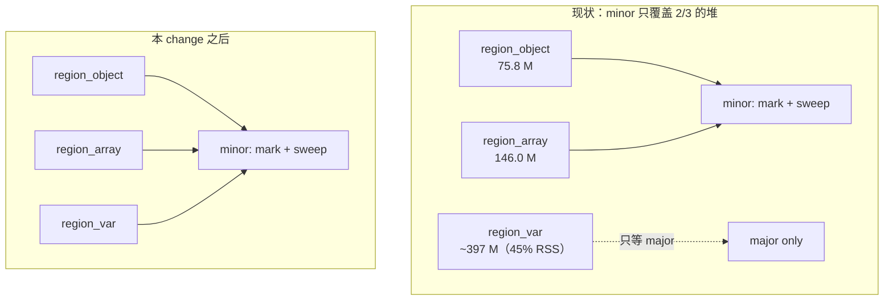

# Design: 变长区参与分代回收

## Architecture

本 change 是「三堆 GC」路线的第 1 步（路线全景见 `proposal.md` 的 Out of Scope）。
它只做一件事：**把 `region_var` 从「非分代、只在 major 被扫」变成「与两个定长区同批的分代成员」。**



minor 周期改造后的形状：

```
run_cycle_collection_minor()
  ├─ retire_thread_tlab()                    # 不变
  ├─ mark_phase_minor()
  │    ├─ 根：pinned roots + external scanner              # 不变
  │    ├─ 根：region_object / region_array 的脏卡条目      # 不变（变长区不需要卡，见决策 3）
  │    └─ BFS 只把「年轻的子节点」入队 —— gen_age_of 现在
  │       读得懂变长块的年龄，老块不再被误当年轻推入        # ★修正（决策 3b）
  └─ sweep_phase_young_only()
       ├─ region_object 的 young 槽                        # 不变
       ├─ region_array  的 young 槽                        # 不变
       └─ region_var    的 young 块                        # ★新增
          freed_bytes 由各区如实自计，数组头不再代记元素字节 # ★修正
```

## Decisions

### Decision 1: `gen_age` 打包进 `type_tag`，并把 `type_tag` 换成 `AtomicU8`

**问题：** 变长块需要一个年龄字段，但 `GcBlockHeader` 被 `const _: () = assert!(size_of == 16)`
钉死，16 字节已被 `generation u32 + size u32 + marked u8 + alive bool + type_tag u8 + size_class u8` 占满。

**选项：**
- **A —— 头扩到 24 字节。** 直接、无位运算。但 `DATA_OFFSET` 从 16 变 24，
  **180 万个 total 恰好 32 字节的块会集体跳到 40 字节档**，按 #526 的实测分布，
  这一项就要吐回 15 MB 以上，还会连带抬高所有中段块。**否决。**
- **B —— 挤进 `type_tag` 的空闲位。** `BlockType` 只有 5 个变体（`Str` / `ArrayValue` /
  `ArrayPrim` / `ArrayStruct` / `Closure`），占 3 位；`PROMOTION_THRESHOLD = 2`，
  年龄取值 0..=2 只需 2 位。头大小不变。

**决定：** 选 B。位布局：

```
type_tag: AtomicU8
  bit 0..2  BlockType（0..=4，`from_u8` 的损坏保护对 5..=7 仍返回 None）
  bit 3..4  gen_age（0..=3；PROMOTION_THRESHOLD = 2 只用到 0..=2）
  bit 5..7  保留（恒 0，校验时可用作损坏探测）
```

**为什么同时要换成 `AtomicU8`：** 写屏障要在 mutator 线程上**无锁读**一个块的 `gen_age`
（判定 old→young 跨代写），而晋升写发生在 STW sweep。`u8` 上的并发读写在 Rust 里是数据竞争；
`AtomicU8` 的 size / align 与 `u8` 相同（1 / 1），换过去**不改变结构体布局**，
且与同结构里已有的 `marked: AtomicU8` / `alive: AtomicBool` 一致。
读用 `Relaxed`（与 `RegionEntry::gen_age()` 同款理由：STW 写、无需同步）。

⚠️ 2 位 `gen_age` 上限是 3。若将来 `PROMOTION_AGE` 要开成旋钮并允许 > 3，
必须重新找位（`size_class` 目前最大 64，也空着 1 位），或回头重新评估选项 A。

### Decision 2: young 集合用「重建」而非「增量维护」

**问题：** `Region<T>` 的 `young_list: Vec<(u32, u16)>` 靠每个 entry 上的 `young_idx`
做 O(1) `swap_remove`，增量维护。变长块没有地方放 `young_idx`（决策 1 已经把头填满了）。

**选项：**
- **A —— 侧表 `HashMap<addr, idx>` 补 `young_idx`。** 每次分配 / tombstone 一次哈希，
  分配路径是最热的路径之一。**否决。**
- **B —— 不做增量维护：`young_list: Vec<NonNull<GcBlockHeader>>` 只 push，
  由 minor sweep 整体消费并重建。** tombstone 不从表里摘（懒删除），
  sweep 遍历时按 `is_alive()` + `gen_age` 过滤，顺手写回新表。

**决定：** 选 B。理由：minor sweep **本来就要遍历整张 young 表**，重建是顺路的零额外成本；
而增量维护的代价是实打实的——#524 正是因为 `young_list` 的维护开销（指令 −0.17%）
才把它改成只在分代模式下维护。变长区直接跳过这笔开销。

**实施期补充（重复条目）：** 懒删除有个设计时没想到的后果——major sweep 会 tombstone 年轻块，
它们作为陈旧条目留在表里；该槽若在下次 minor 之前被 free-list 复用，`alloc` 会**再 push 一次**，
同一地址在表里出现两次 → 每次 minor 连升两级、表还会无界增长。
解法是 `type_tag` 的 bit 5 做 `IN_YOUNG_BIT`：已在表里就不重复 push，O(1) 去重，
不需要 `young_idx` 侧表。测试 `recycled_slot_is_not_listed_twice` 锁住这条。

**必须配套的一处：** `reclaim_dead_var_chunks` 已经在 purge `all_blocks` 和 `free_lists`，
`young_list` 要加进同一个 `retain`（复用现成的 `in_reclaimed` 闭包，不新增查找成本）。
漏了这一步 = 悬垂指针。

### Decision 3（**实施期推翻**）: 变长区不需要卡表

**原决定：** 给 `VarRegion` 自带一套 per-chunk 脏位，理由是「`Closure` 块的出边没有可借的
数组头，借卡会漏掉一整类跨代写」。

**推翻依据：** 那条理由不成立——**变长块根本不会被写**：

| 块类型 | 写入路径 | 卡覆盖 |
|--------|---------|--------|
| `Str` / `ArrayPrim` | 叶子，无出边 | 不需要 |
| `ArrayValue` / `ArrayStruct` | 只经 `Value::Array` owner（`exec_array.rs:274` 的 `write_barrier_array_elem`） | `region_array` 的卡已覆盖 |
| `Closure` | **创建后不可变**（`value_aux.rs:94`、`value.rs:77`、`value.rs:220` 三处注释一致） | 不需要 |

而 minor 的脏卡根扫描重新以老数组头为根，`trace_children` 里的
`arr.mark_backing()`（`value.rs:282`）会标记它的元素块——**现有 mark 机制早就覆盖变长块了**。
闭包与其 `env` 同时创建、同批老化，只可能产生 young→old 边，不可能 old→young。

**新决定：** 不做卡表。原方案的整个阶段 3 取消。

### Decision 3b（**实施期新增**）: 陈旧 mark 位导致的 use-after-free

查证 Decision 3 时发现的真缺陷，比原本要修的两条都严重：

`sweep_phase_young_only` 从不清变长块的 mark 位，而 `gen_age_of` 对变长块是瞎的
（`Value::Str` 落到 `_ => 0` 恒为「年轻」，`Value::Closure` 读的是 **env 的**年龄而非闭包块自己的）。
于是：

```
minor #1: 标记闭包块 → mark 位留着没人清
minor #2: c.mark() CAS 失败 → just_marked = false → children 不再被追
        → 它仍然年轻的 env 数组没被标记 → 当场被 region_array 的 young sweep 掉
        → 闭包还引用着的数组被提前释放
```

`Str` / `ArrayPrim` 是叶子，陈旧 mark 只造成一轮浮动垃圾；`Value::Array` 走头节点、
mark 位被正常清理。**这条只打在 `Closure` 上**——唯一「自身是变长块又有出边」的类型。

**决定：** 两处同修——`sweep_young` 清 survivor 的 mark 位（Decision 2 的实现自带），
`gen_age_of` 改读变长块的真实年龄（老块不再被 minor 推入，从源头不产生陈旧 mark）。
回归测试 `closure_env_survives_repeated_minors` 已验证：不修则 **round 2** 必红
（`live_arrays: 0 vs 1`）。

**残留（已知、有界）：** 从脏卡重新以老数组头为根时，`mark_backing()` 仍会标记一个**老**元素块，
而 minor 不清老块的 mark。该块若随后变成垃圾，会多活一个 major 周期后才被回收
（`sweep()` 清 mark 并保留 → 下一轮 major 才无标记）。是浮动垃圾，不是正确性问题，不在本 change 处理。

### Decision 4: 晋升阈值先统一，不给变长块开小灶

**问题：** `PROMOTION_THRESHOLD = 2` 是为定长对象定的；字符串的存活分布未必一样。

**决定：** 先统一复用。现在**没有任何数据**支持「字符串该用不同阈值」——
提出一个没有依据的第二阈值，等于凭空多一个要调的旋钮。
落地后按 `add-bounded-nursery` 的实测再看要不要拆。
（受决策 1 的 2 位限制，拆分时上限也只有 3。）

### Decision 5: `freed_bytes` 由各区自计，数组头不再代记元素字节

**问题：** `sweep_phase_young_only` 里数组头的 `array_size_estimate` 含
`elem_storage_bytes()`，而元素块住在 `region_var`——minor 从不回收它，账却记了。

**决定：** 沿用 #522 已经确立的口径——**「谁在 alloc 时收了这笔账，谁在 sweep 时退」**。
`VarRegion::alloc_charge_bytes` 已经写明这条规则（`ArrayValue` / `ArrayPrim` /
`ArrayStruct` 块记零，因为数组头通过 `object_size_bytes` 收了元素存储的账）。
所以修法**不是**让变长区去退元素字节，而是：数组头照旧退它收的那笔，
但这笔退账必须与「元素块在同一轮里真的被回收」同时发生——本 change 让 minor 也扫变长区，
这个前提就成立了，虚账自动消失。

⚠️ 这意味着**顺序有依赖**：必须先让 minor 覆盖变长区（决策 1–3），账才自动对上。
不能反过来「先单独修账」——那会把回收量记少，闸门反而过早触发。

## Implementation Notes

- **四处 header 写入点必须同步**（`grep -n 'type_tag: block_type as u8'` 一把抓）：
  `VarRegion::write_fresh_header`（锁路径）、`VarChunkClaim::fill`（TLAB 无锁路径）、
  `VarGcRef::alloc_leaked`、`VarGcRef::leak_block_for_test`。漏一处 = 该路径分配出来的块
  年龄字段是脏的，minor 会误判其代际。
- **free-list 复用路径**：`reinit_slot` 复用一个已 tombstone 的槽时，新块必须
  `gen_age = 0` 且重新入 young 表（与 `Region<T>` 的 `reused slot starts at gen_age=0` 对齐）。
- **`BlockType::from_u8` 的损坏保护**：解包时先 `& 0b111` 再查表，
  高位不再参与判定；`debug_assert` 保留。
- **`young_count`**：`control.rs` 的升级启发式用 `young_before / young_after` 算存活率，
  分母要含变长区，否则存活率被系统性低估、major 升级不触发。

## Testing Strategy

- **单元测试（`var_region_tests.rs`）**
  - `gen_age` 与 `BlockType` 在同一字节里互不干扰（全变体 × 全年龄组合往返）
  - `size_of::<GcBlockHeader>() == 16` 静态断言仍在（已有测试，确认未被破坏）
  - 三条分配路径产出的块都是 `gen_age == 0` 且在 young 表里
  - 晋升：连续 `PROMOTION_THRESHOLD` 次后移出 young 表
  - `reclaim_dead_var_chunks` 同时 purge `young_list`（断言 `young_list ⊆ all_blocks`）
  - 复用的槽不会在 young 表里出现两次
- **单元测试（`arc_heap_tests/generational.rs`）**
  - 年轻的 `Str` 块在 minor 里被回收（`used_bytes` 实际下降）
  - 数组头与其 `ArrayValue` 元素块在**同一次** minor 内一起回收
  - 已晋升的变长块不被 minor 访问
  - **UAF 回归**：闭包的 `env` 只经闭包块可达，连跑 `PROMOTION_THRESHOLD + 2` 次 minor 仍存活
  - 老字符串不再被当作年轻块反复重标
  - `freed_bytes ≤ used_before − used_after`（口径断言）
- **VM 验证**：`./xtask test` 完整 GREEN gate
- **实测对账**：`Z42_GC_MODE=generational Z42_GC_MAX_BYTES=256M` 跑
  `z42c.semantics --release --no-incremental`，确认 minor 的累计 `freed_bytes`
  与 `used_bytes` 的实测下降一致（今天是虚高的）
