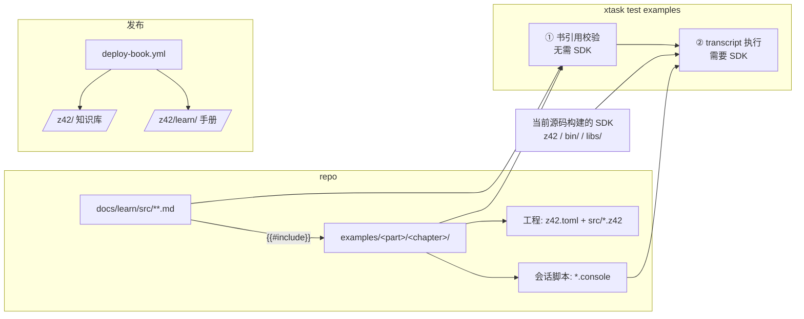

# Design: 学习手册 + 教程示例门禁

## Architecture



**一句话**：书里出现的每一段 z42 代码、每一条命令及其输出，都来自 `examples/` 里的文件；门禁把这些文件
当作用户在终端里的真实操作重放一遍，任何一处对不上就判红。

---

## Decisions

### D1：book 形态 —— 独立 `docs/learn/`，同站子路径发布

- `docs/learn/book.toml`：`language = "zh"`，`[build] create-missing = false`（mdBook 默认会给 SUMMARY 里
  缺失的文件**静默建空页**，必须关掉）。
- 站点布局：知识库保持 `https://z42-lang.github.io/z42/`（现有链接不变），手册在 `/z42/learn/`。
  部署时 `mdbook build docs/book -d _site` + `mdbook build docs/learn -d _site/learn`。
- 两书互链：手册每页只**链接**知识库的机制页，不复制机制内容（doc-system「只链接不复制」）。

### D2：examples 目录结构 —— 镜像手册页路径

```
examples/
  README.md                          # 只讲：这是教程配套、结构约定、如何检查
  getting-started/
    hello-world/                     # ↔ docs/learn/src/getting-started/hello-world.md
      new.console                    # 会话脚本（沙箱 = 本目录的副本）
      hello/                         # 工程
        z42.toml
        src/Main.z42
  basics/
    variables/                       # ↔ docs/learn/src/basics/variables.md
      run.console
      z42.toml
      src/Main.z42
```

- 规则 **R-mirror**：页面 `docs/learn/src/<p>.md` 只能 include `examples/<p>/` 下的文件（去掉 `.md`）。
  目的：章节之间零耦合，改一章的示例不会破坏另一章；删一章时整目录删除即可。
- 目录名用主题 slug、**不带章节号**（插入新章不需要整体改名；顺序由 SUMMARY 决定）。
- 一个章节目录下可有多个工程与多个 `.console`。

### D3：会话脚本（transcript）格式 —— `*.console`

参考 Rust 生态 `trycmd` 的成熟约定，文件内容**就是书上渲染的终端画面**：

```console
$ z42 run .
Hello, World!
$ z42 run broken
error[E0401]: undefined symbol `Consle`
 --> src/Main.z42:4:5
[..]
[exit: 1]
```

| 语法 | 含义 |
|------|------|
| `$ <命令>` | 一步。按类 shell 规则切分参数（支持引号），**不经过 shell**：无管道、重定向、变量展开 |
| 其后到下一个 `$ ` 之前的行 | 该步期望输出（stdout 在前、stderr 在后拼接，与既有 golden 约定一致） |
| `[..]`（行内） | 匹配任意字符（不跨行） |
| `...`（独占一行） | 匹配零到多行 |
| `[ROOT]` | 沙箱根目录的绝对路径（正斜杠形式） |
| `[exit: N]`（块末独占一行） | 期望退出码 N；省略 = 必须为 0 |

规范化：CRLF→LF；块尾空行忽略；实际输出中沙箱路径（含反斜杠形式）替换为 `[ROOT]`。

**可执行的命令**（白名单，其余判红）：

| 命令 | 执行方式 |
|------|---------|
| `z42 ...` | 被测 SDK 根目录下的 `z42`（Windows `z42.exe`），绝对路径调用 |
| `cd <dir>` | 门禁内建：改变后续步骤的工作目录，不得离开沙箱 |
| `cat <file>` | 门禁内建：原样输出文件（用于展示 `z42 new` 生成的文件，从而**校验模板不漂移**） |
| `ls [dir]` | 门禁内建：按字典序列出，目录带 `/` 后缀（跨平台确定性输出） |

> 内建命令的输出与 POSIX 工具在常见情况下一致，读者照抄到自己终端能看到同样的结果；
> 门禁不依赖宿主 shell，Windows 上同样可跑。

**可选 sidecar `example.toml`**（与 `.console` 同目录，作用于该目录下全部 transcript；**本批未实现**，复制进沙箱时已排除，
等嵌入章节需要 `platforms` / `requires` 时再加）：

```toml
timeout-seconds = 120            # 单步超时，默认 120
platforms = ["linux", "macos", "windows"]   # 默认全部；限制平台需在注释里写原因
# requires = ["cc"]              # 预留：嵌入章节落地时实现（外部工具缺失时的行为届时定，CI 上不得跳过）
```

### D4：沙箱与环境隔离

每个 `.console` 独立执行：

1. 在系统临时目录建沙箱（**不得位于任何含 `.z42/` 的目录树下**：apphost 会向上查找 `.z42`，见 `hostrun.rs`）。
2. 复制 `.console` 所在目录内容，排除 `*.console`、`example.toml`、`artifacts/`、`dist/`（避免带入增量缓存）。
3. 子进程环境 `ClearEnv()` 后只放行白名单：`PATH`（前置 `<sdk>` 与 `<sdk>/bin`）、`LANG`、Windows 的
   `SystemRoot`/`TEMP`/`TMP`/`ComSpec`/`PATHEXT`；`HOME` 与 `USERPROFILE` 指向沙箱内的独立 home。
   → 杜绝 CI / xtask 注入的 `Z42_PORTABLE_VM`、`Z42_LIBS`、`Z42_HOME`、`Z42_CONFIG`、`Z42_MODE` 及用户全局配置泄漏。
4. 每步 `Process.Timeout`，超时判红并杀进程树。
5. 成功后删除沙箱（`finally`）；失败时保留并打印路径（`--keep` 强制保留）。
6. transcript 之间并行（`--jobs`，默认 CPU/2）；同一 transcript 内顺序执行。

### D5：书 ↔ examples 双向校验（① 阶段，不需要 SDK，秒级）

扫描 `docs/learn/src/**/*.md`：

| 编号 | 规则 | 为什么 |
|------|------|--------|
| B1 | 每个 `{{#include path[:anchor]}}` 指向的文件存在 | mdBook 缺文件不失败 |
| B2 | anchor 存在，且 `ANCHOR:` / `ANCHOR_END:` 成对 | mdBook 缺锚点渲染空块、无日志 |
| B3 | 禁止行号范围 include（`:3:10`）与 `{{#rustdoc_include}}` / `{{#playground}}` | 行号随代码改动静默错位 |
| B4 | 整文件 include 的目标文件不得含 ANCHOR 标记 | 整文件 include 会把标记行渲染出来（实测） |
| B5 | include 目标必须满足 R-mirror | 章节解耦 |
| B6 | 语言为 `z42` / `console` 的代码块，正文必须恰好是一条 include 指令；需要展示不可运行的示意代码时用 `text` 或显式 `z42,ignore`（汇总计数打印） | **书里不存在未经验证的 z42 代码与命令输出** |
| B7 | 每个 `.console` 至少被一页 include | 书上看不到的会话不该存在 |
| B8 | 每个工程目录（含 `z42.toml`）至少被一个 `.console` 的沙箱覆盖；每个章节目录至少一个 `.console` | 不存在没被跑过的示例代码 |
| B9 | 定义了但没被引用的 anchor → 警告（不判红） | 提示清理 |
| B10 | `docs/learn/src` 下每个 `.md` 都在 SUMMARY 中；SUMMARY 引用的文件都存在 | 配合 `create-missing=false` |

### D6：SDK 从哪来、在哪跑

- 门禁**只认 SDK 布局**（`z42` + `bin/` + `programs/` + `libs/`），通过 `--sdk <dir>` 指定；缺省用
  `xtask build sdk` 的产物 `artifacts/.z42`（缺失或过期时 `test all` 的构建波次负责增量构建）。
- `--no-build` 且 SDK 不存在或**不含 launcher** → **判红**，不再像现在这样打印 skip 返回 0
  （现门禁的「缺前置就跳过」本身就是静默放行的洞；`build sdk --no-build` 会静默缺 launcher，见 `_sdkMergeApphosts`）。
- CI：
  - **test-host（linux / macos，每个 PR）**：跑 examples stage。需要补齐 launcher（apphost stub cargo 构建 + 5 个组件 publish）。
  - **package-host（4 OS，含 Windows）**：在 `test dist` 之后以 `--sdk <打包产物>` 再跑一遍 —— 这是最贴近用户安装形态的一次，且是 Windows 唯一覆盖；其路径过滤加入 `examples/**`、`src/toolchain/launcher/**`、`src/toolchain/builder/**`。
  - **Q1 判定规则**：实施第一步实测 test-host 补 launcher 的增量耗时。≤ 3 分钟 → 按上面方案；
    > 3 分钟 → test-host 只跑 ① 书引用校验，② transcript 执行移到 package-host 并让它对所有 PR 生效。
  - **Q1 结论（2026-09-16）**：本地 warm `xtask build sdk` 25s（apphost stub 是零依赖小 crate）→ 按上面方案，test-host 在
    `test all --no-build` 前单独一步 `build sdk`。CI 实际耗时以首次运行为准，超出 3 分钟再按规则调整。

### D7：命令面与旧机制去留

```
xtask test examples [<examples 下的子路径>...] [--sdk <dir>] [--book-only] [--bless] [--keep] [--jobs N]
```

- `--book-only`：只跑 ①。
- `--bless`：把失败步骤的期望输出**整块**替换为实际输出（沙箱路径已替换为 `[ROOT]`），并打印 diff 提示作者按需补回 `[..]`；不做智能合并（可预测优先）。
- 失败报告：`<transcript>:<行号>` + 命令 + 期望 / 实际的**逐行 diff**（现有 golden 只打首行，不够定位）。
- GREEN stage 名保持 `examples`（`_gateStageNames` 与 test-gate.md 同步）。
- **删除**：`_topLevelExamplesGate`、`examples-known-broken.txt`。
- **迁移**：项目级 `[examples]` / `[[example]]` 目标的编译运行（`_exampleRun`）属于「清单目标」特性测试，
  并入 `targets` stage；删除 `xtask example [name]` 顶层命令，`docs/design/compiler/project.md` 同步。
  → 仓库根 `examples/` 与清单里的 `[[example]]` 从此在命名和门禁上都不再混淆。
- `xtask test changed`：`examples/<p>/**` → `xtask test examples <p>`；`docs/learn/**` → `xtask test examples --book-only`；
  `src/toolchain/{launcher,builder}/**` 追加 `xtask test examples`。映射必须插在「`.md` / `docs/` 一律跳过」之前。

### D8：发布与将来的 playground

- `deploy-book.yml`：
  - 触发路径加 `docs/learn/**`、`examples/**`。
  - 新增 `pull_request` 触发的**仅构建** job：两本书都 build，日志出现 `[ERROR]` 即判红（兜底 D5 覆盖不到的 mdBook 问题）。
  - deploy job 仅在 push main 时运行。
- 代码块信息串约定 ```` ```z42,example=<examples 下相对路径> ````：mdBook 会原样保留为 CSS class（实测），
  将来 playground 的主题 JS 读取它 + 部署时注入的 commit sha，拼出
  `<playground>/?example=<path>&ref=<sha>`，由 playground 拉取**完整工程**运行（书上只展示片段，跳过去跑的是完整程序）。
  本变更只落约定与 B6 对该属性的合法性校验（路径必须存在），不做按钮。
- z42 高亮：highlight.js 无 z42 语法，`docs/learn/theme/` 注册 `z42` 为 `csharp` 别名。

---

## 5. examples 清场明细

| 现有 | 去向 | 依据 |
|------|------|------|
| `embedding/hello.z42`、`multi_line.z42`（+ toml） | `src/toolchain/workload/fixtures/` | 平台 R1–R7 测试夹具；不放 `src/tests/<cat>/`（会被 golden walker 当用例扫） |
| `target_typed_new.z42` | `src/tests/classes/target_typed_new.z42`（断言化） | e2e 覆盖弱（仅 `generic_fullname.z42` 一处） |
| `global_using/` | 多文件工程测试（落点实施时按 runner 能力定，`manifest-targets` 优先） | `global using` 无 e2e 覆盖 |
| `json_serde.z42` | 与 `z42.json/tests/{serialize,deserialize}.z42` 逐项比对，缺的场景补成 `[Test]` | |
| `struct_value_semantics.z42` | 若 `types/struct*.z42` 缺「复制后改原值」断言则补一条 | |
| `exceptions` / `generics` / `oop` / `patterns`（已知编不过） | 删除；它们暴露的语言缺口（`catch when`、`out var`、`!` 后缀、`return default;`、`{x:F2}`、`class X;`、`and` 组合子等）逐条确认已在 `docs/features.md` 或对应设计文档 Deferred 段登记，未登记的补登 | 缺口记录不能随文件一起丢 |
| 其余 16 个单文件 | 删除 | `src/tests` 已有等价覆盖（清单见探索记录） |
| `embedding/hello_c/`、`hello_rust/`、`workspace-*/`、`hello.z42.toml`、`README.md` | 删除 | 非测试；嵌入 / workspace 章节落地时按新结构重建并受门禁约束 |

---

## Implementation Notes

- 门禁代码按职责拆文件（每个 < 500 行）：transcript 解析与匹配 / 沙箱执行 / 书引用校验 / 入口与报告。
- transcript 匹配器是纯函数（期望行序列 × 实际文本 → 结果 + diff），用 xtask 内 `[Test]` 单测覆盖 `[..]`、`...`、`[exit: N]`、路径替换、CRLF。
- 书引用校验只做 mdBook 指令的最小词法识别（`{{#include ...}}`、代码围栏开闭、信息串），不引入 markdown 解析库。
- xtask 源受自举轴 ③ 约束：**只能用上一 nightly 已发布的 stdlib API**（`Process.Timeout` / `ClearEnv` / `Directory.CreateTempDir` 均已存在）。

## Testing Strategy

- **匹配器单测**：见上。
- **阴性对照（必须做）**：逐条人为制造 B1–B10 与 transcript 失配（改一个输出字符、删 anchor、加内联 z42 代码块、放入含 `Z42_LIBS` 的环境），确认每种都判红且报告可定位。
- **环境隔离验证**：在外层设置 `Z42_MODE=jit`、`Z42_LIBS=/nonexistent` 跑门禁，结果必须不变。
- **冷态**：删 `artifacts/.z42` 后 `xtask test examples --no-build` 必须红（不得 skip）。
- **CI**：linux / macos / windows 三类腿各至少一次绿；首章 transcript 在 Windows 上输出一致。
- GREEN：`xtask test` 全绿 + `mdbook build` 两书无 `[ERROR]`。
