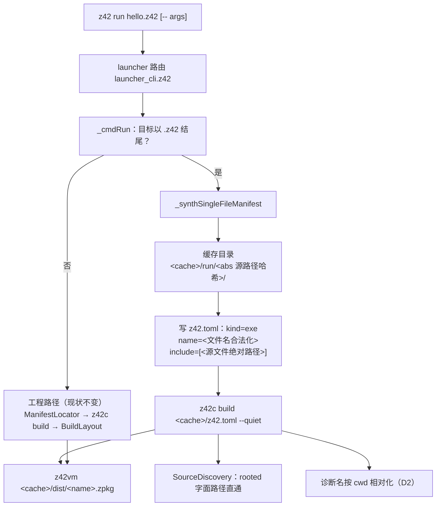

# Design: 单文件运行 `z42 run hello.z42`

## Architecture



单文件模式**只是换了一种得到清单的方式**，之后完全复用工程路径：增量缓存、入口自动检测、
runtimeconfig 侧车、`--mode` / `--set` / `--config` 透传全部照旧。

---

## Decisions

### D1：合成清单，不复制源文件（沿用归档 `add-beginner-cli-onramp` D6）

- 缓存目录 `${Z42_CACHE_DIR:-<SDK 根>/cache}/run/<源文件绝对路径的哈希>/`；清单、`dist/`、增量缓存都在其中。
- `[project] name` = 文件名去扩展名后合法化（`[a-z0-9][a-z0-9._-]*`，非法字符替 `-`；首字符非法则前置 `z`）。
- **禁止把源文件复制进缓存目录**——复制后一切诊断的位置都会变成缓存路径，读者无法回到自己的文件。
- 已验证的现状（当前 SDK 实测）：把绝对路径直接写进 `[sources].include` 会得到
  `z42c build: no sources matched [sources].include` —— 故 D3 必需。

**缓存回收本次不做**（User 2026-09-16）：条目实测 20 KB，且条目数 = 跑过的**不同文件路径数**（同一文件
反复改只占一条），短期不构成问题。已设计的回收方案登记为 Deferred `launcher-future-single-file-cache-gc`
（见阶段 5 任务），要点：`run/.gc-stamp` 机会式触发（距上次 GC < 24h 直接跳过，热路径零成本）→ 淘汰
7 天未使用的条目 → 条目里合成清单的 `include` 指向的源文件已不存在则立即删 → 条目数超 512 按 LRU 封顶。
**不能每次运行都扫**：那会给 0.15 s 的热路径加一次全目录枚举，且绝大多数时候无事可做。

**为什么不用现成的 `z42c --emit-zbc <file> <out>`**：该路径是 golden 测试专用的
**opcode 子集**（`ZW-1A/1B`，无 DBUG、无增量缓存、无 runtimeconfig、无依赖解析除 `Z42_LIBS` 外的部分）。
拿它跑用户程序 = 用户拿到的是一套与 `z42 build` 语义不同的执行结果。不走。

### D2：诊断里的源路径按当前工作目录相对化

**问题**：单文件的源文件在清单目录之外，`srcs` 里是绝对路径，于是诊断会打成
`/Users/me/code/hello.z42(3,5): E0401: …`。两个后果：

1. 与工程模式的 `./src/Main.z42` 不一致；
2. 学习手册的 transcript 由门禁在示例目录里重放比对（`xtask_examples_run.z42` 用
   `Process.WorkingDirectory(cwd)`），绝对路径**跨机器不可复现**，只能靠通配符糊掉，
   而 `learn-writing.md` §5 明确要求「尽量少用通配符，书上展示的是读者真正会看到的内容」。

**方案**：`CompileInputs` 本来就把 `Files`（诊断/CU 显示名）与 `Texts`（内容）分成两个字段，
只是 driver 现在 `cin.Files = srcs` 传了同一个数组。改为：读取仍用 `srcs`，`cin.Files` 传一份
**显示名数组** —— 源文件在当前工作目录之下 → 相对当前目录，否则保持绝对。

**为什么不影响产物字节 / 自举不动点**：写 zpkg 前 `_stabilizeSourceIdentity` 已把
`m.SourceFile` 按 `IncrementalBuild.Rel(projectDir, …)` 相对化并清空 `SourceHash`
（可复现 build_id 的既有机制），显示名的变化不会进到产物里。工程模式下 `srcs` 本就是
`./src/Main.z42` 这种相对路径，相对化是恒等操作 —— **现有输出一字不变**（`test dist` 里
那条 `./src/Main.z42(6,5): E0401` 断言继续成立）。

**边界**：源文件不在 cwd 之下（如 `z42 run ../../elsewhere/hello.z42` 或绝对路径）→ 保持绝对，
不生成 `../../..` 这种比绝对路径更难读的相对路径。与 rustc / clang / tsc 的行为一致。

### D3：`SourceDiscovery` 放行 rooted 字面文件路径

`_expand` 增加一个**前置**分支：pattern 是 rooted 路径（`Path.IsRooted`）且**不含 glob 元字符**
（`*` / `?`）→ 存在则返回该单文件，不存在则返回空数组（交给上层的 `no sources matched` 报错）。

**为什么限定 rooted**：普通工程写 `include = ["src/Main.z42"]`（相对、字面）时，语义是
「相对 `projectDir`」，现状正确。若把「字面路径直通」扩到相对路径，这些工程的解析基准会从
`projectDir` 变成进程 cwd —— 一个静默的语义改变。rooted 路径**当前必然匹配不到任何文件**
（实测 `no sources matched`），故只对它直通是**纯增量**、零回归面。

### D4：语义边界 —— 单文件只能用 stdlib

合成清单不含 `[dependencies]`，与默认工程模板一致。源文件里出现依赖声明无从表达；需要依赖时
用 `z42 new`。这条写进第 2 章末尾的「下一步」与第 3 章开头的「什么时候需要工程」。

### D5：`z42 hello.z42` 简写

`launcher_cli.z42` 现有 `c0.EndsWith(".zpkg") || c0.EndsWith(".zbc")` → `_cmdRun` 的直通，
扩到 `.z42`。`_isSourceProject` 对应放行 `.z42`（现在它只认目录与 `z42.toml`）。

### D6：学习手册第 2/3 章重排（User 2026-09-16 裁决）

| | 现状 | 改后 |
|---|---|---|
| 第 2 章 Hello, World | `z42 new` → 工程结构 → `z42 run` → 读代码 → 参数 → 错误 | **写 `hello.z42`（5 行）→ `z42 run hello.z42` → 读代码 → 参数 → 错误** |
| 第 3 章 | 工程与构建（含「单文件运行」一条） | **工程与构建**：什么时候需要工程 → `z42 new` → `z42.toml` → `build` / `--release` / 产物 / `clean` → 多源文件 |

单文件 hello **不需要 `namespace`**（当前 SDK 实测通过）：

```z42
using Std.IO;

void Main() {
    Console.WriteLine("Hello, World!");
}
```

于是第 2 章不必解释命名空间、清单、`src/**/*.z42` glob —— 这三个概念全部推迟到第 3 章，
在读者**已经跑通过程序**之后、且**确实需要**它们时才出现。

`examples/` 随之重排（`learn-writing.md` B5：页面只能 include 同名章节目录下的文件）：

```
examples/getting-started/hello-world/        ← 第 2 章（全部单文件）
  hello/{hello.z42, run.console}
  greet/{greet.z42, run.console}
  typo/{typo.z42, run.console}
examples/getting-started/projects/           ← 第 3 章
  new/new.console                            ← 从 hello-world/new/ 移来
  multi/{z42.toml, src/…, run.console}
```

## Implementation Notes

- 缓存目录哈希：复用 stdlib 已有的内容哈希（与 `ZpkgBuilder.SourceHashHex` 同族），对
  **绝对路径字符串**取哈希，不读文件内容 —— 同一文件改内容仍落同一缓存目录，增量才生效。
- 合成清单每次运行都重写（成本可忽略），避免用户移动文件后清单陈旧。
- `_isSourceProject` / `_resolveRunManifest` 的单文件分支要在 `--bin` 检查之前短路：单文件没有
  多目标概念，`--bin` 与之同用应报错。

## Testing Strategy

- **单元**：`src/libraries/z42.project/tests/source_discovery_glob.z42` —— rooted 字面路径命中 /
  不存在返回空 / 与 glob include 混用 / rooted 且含 `*` 仍走 glob 分支。
- **端到端冒烟**：`scripts/test/xtask_test_dist_cli.z42`（用打包出的 SDK 跑）——
  `z42 run hello.z42` / `z42 hello.z42` 简写 / `-- <args>` 传参 / 编译错误的诊断路径是
  `hello.z42(…)` 而非绝对路径 / 第二次运行走增量。
- **手册门禁**：`xtask test examples` 重放第 2、3 章全部会话脚本。
- **回归**：`test dist` 既有那条 `./src/Main.z42(6,5): E0401` 断言必须**一字不变**地继续通过
  （D2 对工程模式是恒等操作的证明）。
- **完整 GREEN**：`xtask test`（改了 z42c driver 与 stdlib 库，自举链在覆盖面内）。
