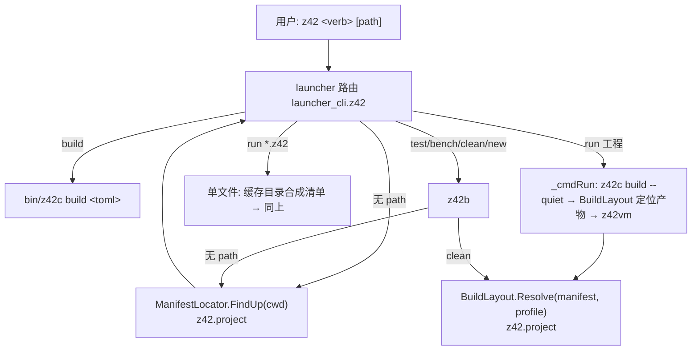

# Design: 新手上手路径的 CLI 补齐

## Architecture



两个新的共享组件都放 `z42.project`（z42c 自依赖的 6 库之一，破环预建用当前源重建 → 同一 PR 可加可用；**xtask 源不得使用**，自举轴 ③）：

- `ManifestLocator` —— 「用户说的是哪个工程」的唯一答案。
- `BuildLayout` —— 「这个工程的产物在哪」的唯一答案（现分散在 z42c `BuildPaths`、launcher 写死的 `<proj>/dist`、z42b clean 的 `./dist`+`./cache` 三处，彼此不一致）。

---

## Decisions

### D1：清单定位规则（ManifestLocator）

从起点目录逐级向上，在**每一层**：

1. 有 `z42.toml` → 选中。
2. 否则恰好一个 `*.z42.toml` → 选中；多于一个 → 报错并列出候选（`请指定其一：z42 build app.z42.toml`）。
3. 否则有 `z42.workspace.toml` → 选中工作区。
4. 到文件系统根仍无 → 报错：`当前目录及上级目录中没有 z42.toml（新建工程：z42 new <name>）`，退出码 2。

- 最近者优先（与 cargo 一致）；工作区成员目录里得到成员清单，工作区上下文由 z42c 既有 `_findWorkspaceToml` 处理。
- 删除 launcher `_findProjectToml` 的「递归 glob 取 `tomls[0]`」兜底：会选中嵌套子工程，且结果依赖枚举顺序（common-pitfalls §1）。
- 各命令对工作区根的行为：`build` → 构建工作区；`run` / `test` / `publish` → 报错并列出成员（本变更不做「默认成员」推断）。
- 使用点：launcher 的 `build`（解析后显式传给 z42c）、`run`、`publish`（positional 改可选）；z42b 的 `build` / `test` / `bench` / `clean`；z42c `build` 无参时同样调用（替换「打印 usage 退出 0」）。

### D2：安装后 PATH（随 PR-B3 落地；User「按正规的来」→ 取 A）

既有决策（launcher.md「安装脚本只打印 PATH 接入指引，不自动改 profile」）。

- **(A，推荐) 默认写入 profile，`--no-modify-path` 关闭**：rustup / deno / bun 的通行做法；写入前打印将要改的文件，幂等（带标记注释，重复安装不重复追加）。
  sh：按 `$SHELL` 选 `~/.zshrc` / `~/.bashrc` / `~/.profile`（fish 写 `conf.d/z42.fish`）；ps1：写用户级 `Path` 注册表项。
  教程第 1 章变成「装完重开终端 → `z42 --version`」。
- (B) 保持只打印：教程需多一步手动编辑 profile，且各 shell 写法不同，是新手流失点。
- 仓库内 `scripts/install-z42.*`（贡献者引导，装到 `<repo>/.z42`）**永远不改 profile**。

### D3：安装位置与布局

- 默认 `${Z42_HOME:-$HOME/.z42}`（Windows `%USERPROFILE%\.z42`）即 **SDK 根**（沿用 unify-launcher-apphost：SDK 不做多版本，更新 = 覆盖）。
- 覆盖方式：解压到同目录下 `.staging/` → 只替换 SDK 自带的顶层条目（`z42`、`bin/`、`programs/`、`libs/`、`native/`、`manifest.toml`）→ 删 staging。**不删除**其它内容（用户缓存、workload 等），不再 `rm -rf "$DEST"`。
- 写 `install.toml`：`channel`、`version`、`installed-by = "installer" | "repo"`、安装时间。`self-update` 与 `--version` 读它。

### D4：安装脚本本体

- `scripts/install/install.sh`：**POSIX sh**（`curl … | sh` 可用），依赖仅 `curl|wget`、`tar`、`sha256sum|shasum`；不需要 python3、不需要仓库 checkout。
- `scripts/install/install.ps1`：PowerShell 5.1+，`irm … | iex` 可用。
- 参数：`--version <x.y.z|nightly>`、`--dest <dir>`、`--no-modify-path`、`--archive <本地包>`（离线 / CI 测试用，跳过下载与校验源）、`--dry-run`。
- 资产名直接拼：`z42-sdk-<label>-<rid>.tar.gz`（Windows `.zip`），`label` = 版本号或 `nightly`；校验用同 release 的 `SHA256SUMS`（纯文本，无需 JSON 解析）。
- 平台检测：支持 macos-arm64 / linux-x64 / linux-arm64 / windows-x64；其余（含 Intel Mac）明确报「暂不支持」并链接平台支持表。
- 托管：
  - `https://z42-lang.github.io/z42/install.sh` / `install.ps1`（deploy-book 工作流把 `scripts/install/` 拷进站点根）；
  - 同时作为 release 资产上传（固定到版本的安装方式）。
- `scripts/install-z42.{sh,bat,command}` 改为薄封装：读 `versions.toml` 得版本 → 调 `scripts/install/install.*`，`--dest <repo>/.z42 --no-modify-path`，写 `installed-by = "repo"`。**安装逻辑只剩一份**。
- 仓库名统一 `z42-lang/z42`。

### D5：默认安装通道 —— ✅ User 裁决 A（默认 nightly = 最新版）

- **(A，推荐，1.0 前) 默认 `nightly`**：教程跟随 main；pre-1.0 所有 tag 都是 prerelease，GitHub 的 `releases/latest` 本就解析不到它们。手册首页注明「手册对应 nightly」。
- (B) 默认最新 tag：需脚本查询 GitHub API 找最新 prerelease（匿名 API 有速率限制，CI 批量安装易撞）；且教程内容会领先于该版本。

### D6：单文件运行 `z42 run hello.z42 [-- args]`

- 缓存目录：`${Z42_CACHE_DIR:-<用户 home>/.z42/cache}/run/<源文件绝对路径的哈希>/`。
- 在其中合成最小清单（`kind="exe"`，`name` = 文件名去扩展名的合法化形式，`include` = 源文件**绝对路径**，`[build]` 产物目录指向缓存目录），之后完全复用工程 `run` 路径（入口自动检测、增量缓存、runtimeconfig）。
- **诊断必须显示用户的原始路径**：若 `SourceDiscovery` 不接受清单外的绝对路径，扩展它接受字面文件路径 —— **禁止**把源文件复制进缓存目录（否则报错位置变成缓存路径）。
- 语义边界：单文件 = 只能用 stdlib（与默认工程模板一致），不能声明依赖；需要依赖时报错提示 `z42 new`。
- `z42 hello.z42` 简写：路由已有 `.zpkg` / `.zbc` 简写，扩展到 `.z42`。
- 同步：launcher.md 删除 `launcher-future-single-file-exe-zpkg` 延后项及 roadmap 索引行，改写为已实现。

### D7：`z42 --version` / `-V` / `z42 version` / `z42 help [命令]`

输出一行：`z42 <version> (<rid>, <build-date>)`，数据来自 SDK `manifest.toml`；开发树（无 manifest）输出 `z42 (dev build)`。
`z42 help <cmd>` 等价于 `z42 <cmd> --help`。

### D8：`z42 new` 修正

- `--path <dir>`：父目录（与帮助一致），工程目录 = `<dir>/<name>`。
- 名字校验：`[a-z0-9][a-z0-9._-]*`，否则报错并给出建议名。
- ~~`--test` 模板~~：移除（D11）——实测任何工程的 `tests/*.z42` 都被 `z42 test` 自动发现，无需依赖声明。
- 完成提示：
  ```
  Created executable project `hello` in hello/

    cd hello
    z42 run
  ```
  （`z42 run` 依赖 D1 生效；lib 模板提示 `z42 build`）
- exe 模板输出改为 `Hello, World!`。
- 生成的 README 同步；删除 `builder_new.z42` / `builder_cli.z42` / `builder_commands.z42` 中过期的 PARKED 注释。
- 模板正确性由 `add-learn-book-examples-gate` 第 2 章 transcript（`z42 new` + `cat`）持续校验。

### D9：`z42 self-update` —— ✅ User 裁决：移除（见 D11），以下原方案作废

- `installed-by = "installer"`：launcher 内复用下载 / 校验 / 解压代码，按 D3 的 staging 替换；Windows 上正在运行的 `z42.exe` 先改名 `z42.exe.old`，下次启动清理。
- `installed-by = "repo"` 或无 `install.toml`：拒绝并提示「由仓库引导安装，请运行 `scripts/install-z42.sh`」。
- 不再以 `Z42_PORTABLE_VM` 是否存在判断（SDK apphost 必设它，现判断永远拒绝）。
- 推荐纳入本变更；若想缩小范围，可延后并在教程中写「重新运行安装命令即更新」。

### D10：输出与产物布局

- `BuildLayout.Resolve(manifest, profile)`（z42.project）：由 z42c `BuildPaths` 的规则下沉而来，z42c / launcher `run` / z42b `clean` / publish 共用。
- `z42 run` 按 `BuildLayout` 定位产物（修写死 `<proj>/dist`）。
- `z42 clean` 删除 `BuildLayout` 给出的产物目录与缓存目录（修 `./cache` 从未被写入的问题）。
- z42c `build` 新增 `--quiet`：抑制 `cached: N/M files` 等进度输出；launcher `run` 内部构建时传 `--quiet`。`z42 build` 保持现有输出（开发者依赖该信息判断增量是否生效）。
- z42c `build` 无清单且定位失败：打印 D1 的错误、退出码 2（不再 usage + 0）。

### D11：命令面梳理（User 2026-09-16）

依据全量盘点（每个命令的仓外调用方 / 是否依赖已废弃的多版本运行时模型 / SDK 形态下是否可用）：

| 处置 | 命令 | 理由 |
|------|------|------|
| 移除 | `info` / `list` / `default` / `link` / `uninstall`、`run --runtime`、runtimeconfig `version` 键 | 服务于多版本运行时模型；SDK 已是单版本（unify-launcher-apphost），仓外零调用方 |
| 移除 | `which` | 唯一调用方是 `test dist` 的冒烟断言，改为 `--version` 与新手路径冒烟 |
| 移除 | `self-update` | SDK 形态下 apphost 必设 `Z42_PORTABLE_VM` ⇒ 永远拒绝；且按旧布局替换。更新 = 重跑安装脚本 |
| 移除 | `install <ver>` | 下载的 runtime 包不含 z42vm，装完也跑不起来；平台运行时包由 `workload install` 装入 |
| 移除 | `run <toml> --rid`（隐藏）、z42b `run` 桩 | 无测试、无调用方；桩只打印「由 launcher 提供」 |
| 移除 | `z42 new --test` 模板 | 模板本身编译失败；且任何工程的 `tests/*.z42` 已被 `z42 test` 自动发现，无需单独工程形态 |
| 保留 | `new` / `build` / `run` / `test` / `bench` / `clean` / `repl` / `publish` / `export` / `workload` | 用户工作流 / 平台发布 |
| 新增 | `version`（`--version` / `-V`）、`help [<命令>]` | 正规 CLI 必备 |

launcher 依赖随之收缩：删 `z42.workload.desktop`（仅隐藏 `run --rid` 使用）、`z42.encoding`（无用）。
命令参考落 book [z42 命令参考](../../../book/src/toolchain/cli.md)。

---

## 延后

### onramp-future-unify-build-executor：统一 `z42 build` 的执行者

- **来源**：add-beginner-cli-onramp 探索
- **触发原因**：`z42 build` 转发 z42c、z42b 另有一套 build，产物目录约定不同（`<proj>/dist` vs `<src>/artifacts/<name>/<profile>/dist`）；z42b 的 `Z42cCompiler` 仍缺增量缓存、`[project].entry`、`[[exe]]`、工作区
- **前置依赖**：z42b build 功能追平 z42c build
- **触发条件**：z42b 补齐上述能力，或需要在 build 中编排非编译步骤时
- **当前 workaround**：本变更 `BuildLayout` 先统一「产物在哪」的解析，执行者保持 z42c

---

## Testing Strategy

`xtask test dist`（真实 SDK 形态）新增用例，每条先写成失败再修：

| 场景 | 断言 |
|------|------|
| 空目录 `z42 build` / `z42 run` | 退出码 2 + 提示 `z42 new` |
| 子目录 `src/` 内 `z42 run` | 找到上级工程并运行 |
| 同层两个 `*.z42.toml` | 报错列出候选 |
| `z42 new hello && cd hello && z42 run` | 输出 `Hello, World!`、stderr 为空 |
| `z42 new x --path sub` | 工程位于 `sub/x` |
| `[build] dist_dir` 自定义后 `z42 run` / `z42 clean` | 找到产物 / 清干净 |
| `z42 run hello.z42 -- a b` | 输出参数；改源文件后重跑体现修改；编译错误位置显示原始路径 |
| `z42 --version` | 匹配 `z42 [..] ([..])` |
| `install.sh --archive <刚打的包> --dest <tmp> --no-modify-path` 然后 `<tmp>/z42 --version` | linux / macos |
| `install.ps1 -Archive … ` | windows（package-host） |
| profile 写入幂等（D2=A 时） | 装两次，profile 中只有一段标记块 |

`ManifestLocator` / `BuildLayout` 另有 z42.project `[Test]` 单测。
publish-nightly 之后加一个轻量 job：用 Pages 上的真实 URL 安装 nightly 并 `z42 --version`（验证托管链路）。
