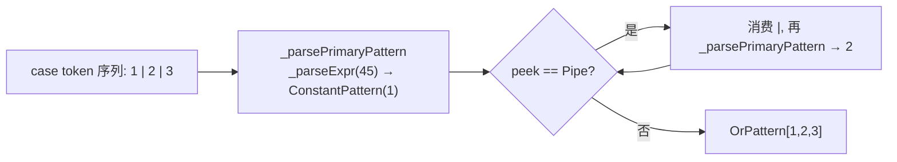

# Design: 模式匹配 A2（or / `@` / `..=` / 关系）

## Architecture

A2 **不新增编译器阶段、不改数据流**，只在 A1 已建的三层递归下降引擎上加节点与分支：

```
源码  case 1 ..= 5 | 100 if flag:
  │  syntax（PatternParser._parsePattern —— A2 变为 or-链）
  ▼  OrPattern[ RangePattern(1,5), ConstantPattern(100) ]（+ 守卫 flag）
  │  semantics（PatternBinder.Bind —— A2 加 4 分支 + 可比较校验）
  ▼  BoundOrPattern[ BoundRangePattern, BoundConstantPattern ]
  │  semantics（PatternEmitter.EmitMatch —— A2 加 4 lowering）
  ▼  既有 IR：Ge(subj,1)→Le(subj,5)→matchL / 失败落 alt2：Eq(subj,100)→matchL / 全失败→failL
```

三个应用位点（switch-stmt / switch-expr / is）仍共用同一 `PatternParser`/`PatternBinder`/`PatternEmitter`，
A2 的差异全部落在**这三个类的内部**，接线点（`StmtParser`/`ExprParser`/`StmtBinder`/`ExprTyper`/…）**零改动**——
它们只调 `_parsePattern` / `PatternBinder.Bind` / `PatternEmitter.EmitMatch`，A2 在其内部扩展。

### 新节点四则（syntax `Pattern.z42` + semantics `BoundPattern.z42` 各 4）

| syntax 节点 | 字段 | bound 节点 | 字段 |
|-------------|------|-----------|------|
| `OrPattern` | `Pattern[] Alts, int Count` | `BoundOrPattern` | `BoundPattern[] Alts, int Count` |
| `AtPattern` | `string Name, Pattern Sub` | `BoundAtPattern` | `string Name, Z42Type Type, BoundPattern Sub` |
| `RangePattern` | `Expr Lo, Expr Hi` | `BoundRangePattern` | `BoundExpr Lo, BoundExpr Hi` |
| `RelationalPattern` | `int Op, Expr Value`（Op=TokenKind Gt/GtEq/Lt/LtEq） | `BoundRelationalPattern` | `int Op, BoundExpr Value` |

## Decisions

### Decision 1: 应用位点 scope —— 四形态全入 switch 臂；`is` 只收 `..=`/关系

**switch 语句 case + switch 表达式 arm**：四形态全部支持（arm 由 `:` / `=>` 定界，`|` 不与位或歧义）。

**`is` 表达式**：只支持 `..=`（`x is 1 ..= 5`）与关系（`x is > 0`），**不支持 or 与 `@`**。理由：

- **or `|` 在 is 与位或歧义**：`x is Circle | flags` 在表达式文法里恒解析为 `(x is Circle) | flags`（位或，
  `is` bp 60 > `|` bp 44）。C# 亦为此用 `or` 关键字而非 `|`；我们用 Rust `|`，故把 or 限定在**定界的 switch 臂**内，
  is 保持 `|` = 位或语义不变（零回归）。
- **`@` 在 is 与类型引导冲突**：is 的老路把 `x is Ident` 的 `Ident` 当**类型**解析（`x is Point p`）。`x is p @ ...`
  的 `p` 是**绑定名**不是类型 → 与类型引导路径冲突，消解成本高、收益低（is 的整体绑定可用外层赋值替代）。defer。
- **`..=` / 关系入 is 无歧义**：关系起始 `>`/`>=`/`<`/`<=` 在 `is` 之后是**新** lead（老 is 后必是类型，类型不以
  比较符起始）；`..=` 尾随于字面量（A1 已支持 `x is 1` 常量模式，A2 只是让 `1` 后可接 `..=`）。二者纯扩展、零回归。

> **实现**：is 位点通过扩 `PatternParser._isPatternLead`（+ 关系 4 符）自动获得关系/范围；or/`@` 不进
> `_isPatternLead`、`is` 分支也不调 or-链入口 → 天然不入 is。

### Decision 2: or-模式与常量解析 bp —— 常量子模式在 bp>44 解析，`|` 归模式层

**问题**：A1 的 `ConstantPattern` 经 `_parseExpr(0)` 解析（minBp=0）。`case 1 | 2:` 会被 `_parseExpr(0)`
**贪吃**成一个位或表达式 `1|2`（`|` 是 bp 44 的中缀位或），or-模式永远拿不到 `|`。

**解**：A2 把模式内常量一律用 `_parsePatternConst()` = `_parseExpr(45)` 解析（minBp=45 > `|` 的 44）→
`_parseExpr` 在 `|` 处停下（`bp 44 < 45` break），`|` 交回模式层由 or-链消费。

- 字面量 / 一元负号 / 点分名（`Color.Red`，`.` 是 postfix 不受 minBp 限）在 bp 45 下照常完整解析。
- 仅 `^`(46)/`&`(48)/比较(50+)仍会被 bp45 吃入常量——但这些**不是**我们要支持的模式组合子（我们只支持 `|`
  or、`..=` range、关系前缀），且模式里写 `case 1 ^ 2:` 属病态、结果 = 常量 `3`，可接受边角（与 C# 一致：
  C# 常量模式也允许常量表达式）。

**自举不动点风险与消解**：改 bp 0→45 只影响**常量模式解析路径**。该路径仅在 `switch` case / `switch`-expr arm /
结构化 `is` 常量 出现，而 **z42c/stdlib/xtask 源无 switch、`is` 仅 `x is T`（走未改老路，不经常量模式）** → 生产源
根本不走此路径 → gen1==gen2 不动点不受影响。**回归保障**：现有 `switch`/`is` **测试** goldens 里的常量若含
`| ^ & 比较`（极不可能）会被 bp45 改变解析——IMPL 首步 grep 全部 `switch`/`is` 测试确认无此写法（A1 的
`pattern_core`/`pattern_is` 常量均为纯字面量/枚举，安全）。



### Decision 3: or-模式 A2 不带绑定（合流复杂度 defer）

`P1 | P2` 若两 alt 各自绑定变量，Rust 要求**绑定集完全一致**（同名同类型），且在合流点（matchL）需 phi/拷贝到
公共寄存器——A1 的绑定是 `Locals.Put(name, reg)` 编译期映射，不同 alt 产不同 reg，合流点静态映射会取「最后一个
Put」而非运行时实际命中的 alt → 语义错。正确实现需引入合流拷贝（每 alt 把绑定值写入预分配公共 reg）。

A2 **禁止 or 子模式含任何绑定**（含裸绑定 / `T x` / `@` / 位置·属性里的子绑定 / 嵌套绑定），binder 递归检测到
绑定即报错「or-模式的子模式暂不支持绑定（A2）」。A2 的 or 覆盖：多常量（`1|2|3`）、多类型无绑定（`Circle|Square`）、
多区间（`1..=5 | 10..=20`）、通配组合——纯 test 组合，占绝大多数实用场景。带绑定 or 留后续独立迭代。

### Decision 4: lowering 四则（递归下降，短路 BrCond，复用 A1 `EmitMatch` 契约）

`EmitMatch(subj, pat, matchL, failL)` 契约不变（匹配→matchL，失败→failL，返回时当前块已 EndBlock）。四新节点：

**OrPattern** —— 依次尝试，前 n-1 个失败落下一 alt，末个失败落 failL：
```
i = 0
while i < Count - 1:
    nextL = Fresh("pat_or")
    EmitMatch(subj, Alts[i], matchL, nextL)   // alt 失败 → 试下一 alt
    StartBlock(nextL)
    i++
EmitMatch(subj, Alts[Count-1], matchL, failL)  // 末 alt 失败 → 整体失败
```

**AtPattern** —— 先绑 name=subj（同 A1 裸绑定，别名到 subj 寄存器），再匹配子模式：
```
Locals.Put(Name, subj)          // @ 绑定：整体别名（子模式失败落 failL 时该绑定在 fail 路不被读，安全）
EmitMatch(subj, Sub, matchL, failL)
```

**RangePattern** —— `subj >= Lo && subj <= Hi`，两段短路：
```
loR = _ee.Emit(Lo); geR = Alloc(Bool); Emit(GeInstr(geR, subj, loR))
midL = Fresh("pat_rng"); EndBlock(BrCond(geR, midL, failL)); StartBlock(midL)
hiR = _ee.Emit(Hi); leR = Alloc(Bool); Emit(LeInstr(leR, subj, hiR))
EndBlock(BrCond(leR, matchL, failL))
```

**RelationalPattern** —— 单比较：
```
vR = _ee.Emit(Value); rR = Alloc(Bool)
Emit(<Op>Instr(rR, subj, vR))   // Op→ GtInstr / GeInstr / LtInstr / LeInstr
EndBlock(BrCond(rR, matchL, failL))
```

- **jit 安全**：四形态均不 emit `as_cast`+`field_get`（range/关系比较基元、or/@ 委派子模式），沿用 A1 直读范式，
  无 record 程序的 as_cast-field_get jit 误编风险。仍**必 jit 双验**（比较指令的 int/char/double 路径）。
- **`Ge`/`Le`/`Gt`/`Lt` 指令**：`{Lt,Le,Gt,Ge}Instr(dst, a, b)` 已存在（`z42.ir` `IrInstr.z42`，
  ZbcWriter/Reader Op.Lt/Le/Gt/Ge 已定义），与 A1 用的 `EqInstr(dst,a,b)` 同形。

### Decision 5: 词法 —— `@`(At) 单字符 / `..=`(DotDotEq) 三字符（须先于 `..`）

- `TokenKind`：末尾追加 `At = 152` / `DotDotEq = 153`（不重排、不入 zbc，同 `Readonly`/`Const` 先例）。
- `Lexer`：
  - `..=`：在现有 `c=='.' && d=='.'`（→`DotDot`）判定**之前**插 `c=='.' && d=='.' && _ch(pos+2)=='='`
    → `DotDotEq`，前进 3 字符。三字符前进用 `_adv2()` + `_advance()`。
  - `@`：单字符段加 `if (c == '@') { emit(At, "@"); return; }`。`@` 此前落未知/错误路径，z42c 源无裸 `@`
    → 零回归。
- **byte-identical**：z42c 源无 `@`/`..=` → 新词法分支永不触发于生产源，词法输出逐 token 不变。

## Implementation Notes

- **PatternParser 重构**：`_parsePattern()` 变薄 = `_parsePrimaryPattern()` 结果 + or-链循环
  （`while peek==Pipe { advance; alts.push(_parsePrimaryPattern()) }`，仅 1 个 alt 时不包 `OrPattern` 直接返回）。
  A1 现 `_parsePattern` 体整体挪进 `_parsePrimaryPattern`。`_continueFromType`（is 复用）**不接** or-链（is 不收 or）。
- **primary 新起始**（在 `_parsePrimaryPattern` 内）：
  1. **关系**：`k ∈ {Gt,GtEq,Lt,LtEq}` → 消费 op + `_parsePatternConst()` → `RelationalPattern(op, v)`。
  2. **`@` 绑定**：`k==Identifier && peekAt(1)==At` → 取 name + 消费 `@` + `_parsePrimaryPattern()`（子模式，
     不含 or）→ `AtPattern(name, sub)`。须在「标识符走 `_parseType`」分支**之前**判。
  3. **`..=` 尾随**：常量分支解析出 lo 后 `if peek==DotDotEq { advance; hi=_parsePatternConst(); → RangePattern }`。
  4. 常量分支：`_isConstStart` → `_parsePatternConst()`（=`_parseExpr(45)`）替代原 `_parseExpr(0)`。
- **`_isPatternLead`**（is 结构化前瞻）：A2 追加 `Gt/GtEq/Lt/LtEq` → is 收关系/范围；**不加** `Pipe`/`At`。
- **PatternBinder**：
  - `_bindOr`：逐 alt `Bind`（subjType 传同一被匹配类型）；递归检测 alt 是否含绑定（`_patternBinds(bp)`
    遍历 BoundPattern 树查 `BoundBindingPattern`/`BoundTypePattern.Bind!=""`/`BoundAtPattern`/子节点）→ 有则报错。
  - `_bindAt`：`env.Define(Name, subjType)` + `Bind(Sub, subjType, env)`。
  - `_bindRange`/`_bindRelational`：`_bindExpr(Lo/Hi/Value)`；校验 `subjType` 为可比较基元
    （`_isComparablePrimitive`：int/long/short/byte/…/float/double/char）→ 否则报错。
- **PatternEmitter**：4 分支照 Decision 4；`_relInstr(op, dst, subj, v)` 按 op 派发 4 比较指令。
- **文件行数**：A2 后各文件仍须 <500 行。A1 现值：`PatternParser` ~130 / `PatternBinder` ~150 /
  `PatternEmitter` ~130 / `Pattern` ~90 / `BoundPattern` ~110——余量充足。

## Testing Strategy

- **e2e 自检**（`src/tests/pattern-matching/pattern_a2.z42`，`Assert` 范式、空 stdout）：
  - or：`1|2|3`（int）、`Circle|Square`（多类型无绑定）、`1..=5 | 10..=20`（多区间）、`_` 参与 or。
  - `@`：`p @ Point(0, y)`（绑整体 + 解构）、嵌套 `Line(a @ Point(_,_), _)`。
  - `..=`：int / char（`'a'..='z'`）/ double 区间，含端点边界（lo、hi 命中）。
  - 关系：`> 0` / `>= 0` / `< 0` / `<= 0`，int/char/double。
  - 每形态在 **switch-stmt + switch-expr** 各验；`..=`/关系另在 **is** 验（`x is > 0` / `x is 1..=5`）。
  - 绑定作用域：`@` 绑定名与子模式绑定名在 arm body / is-true 分支可见。
- **负例**（binder 诊断，用 analyzer/编译错测或注释说明）：or 带绑定报错；`..=`/关系用于非可比较类型报错。
- **回归**：A1 `pattern_core` / `pattern_is` 全绿且发码不变；现有 `switch*` / `is` goldens 不变（byte-identical）。
- **⚠️ jit 双验**：`xtask test e2e --file pattern_a2`（interp + jit）——range/关系 emit `Ge`/`Le`/`Gt`/`Lt`，
  or emit 多路 BrCond 链，interp 过 ≠ jit 过，必 `--mode jit` 复验。
- **自举**：`xtask test bootstrap`（越界门，验上一 nightly 仍能编当前源）；本机 z42vm 退出挂起 → 完整 gate
  交 CI（gen1==gen2 不动点 + test-vm/stdlib-jit + bootstrap-no-csharp）。本机靠 `xtask build compiler`（catch
  z42 编译错）+ 单 `--file` e2e。
- **冷启动内部环**：A2 给 z42c.syntax 加 4 新 `Pattern` 节点被 semantics 消费——A1 已随 `_buildCompilerViaZ42c`
  retry-on-fail 修法收敛（bootstrap-seed 轴④ z42c-内部-包变体）；A2 仍 **clean-cold 本地验**
  （`rm -rf artifacts/build/compiler && xtask build compiler` 单次须绿）。
