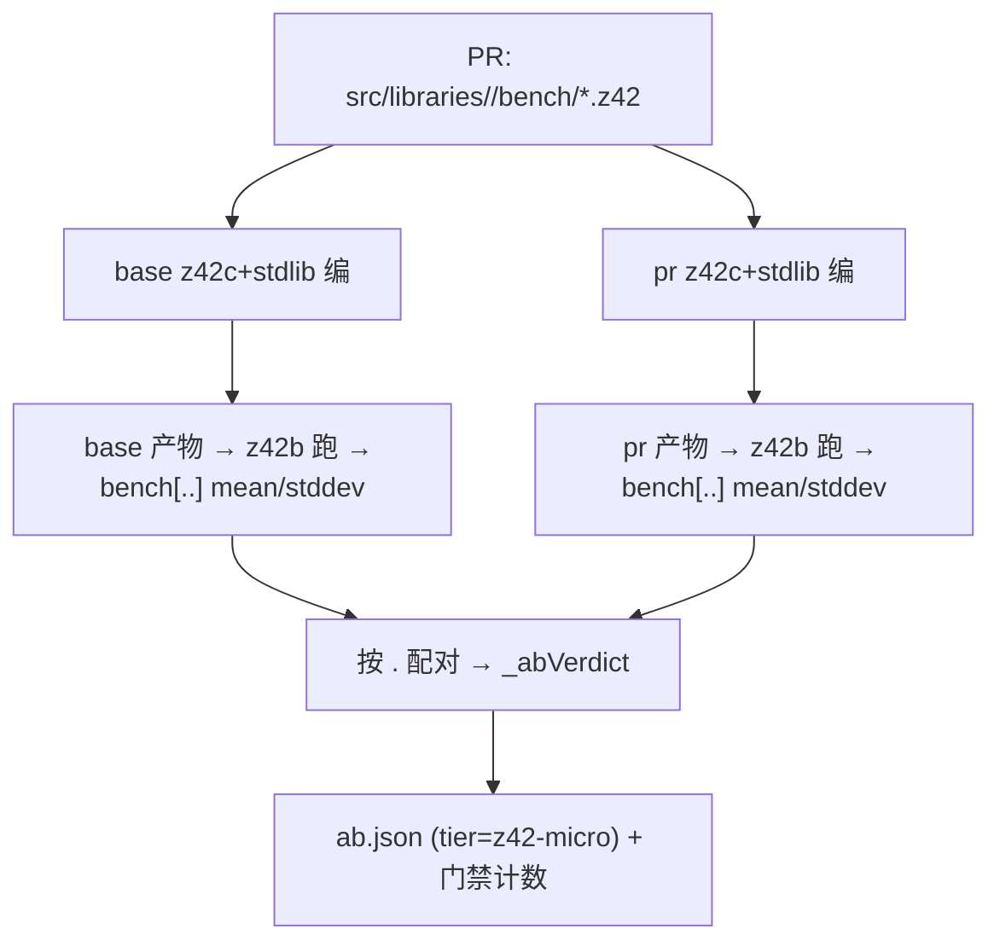

# design — micro + criterion tier 的同-runner A/B 门禁

> SoT for this change。前身 Stage 1 的 `_abVerdict` / `_abOneScenario` / CI base-build 机制在
> [add-same-runner-ab-bench-gate/design.md](../add-same-runner-ab-bench-gate/design.md)，本文件只增量。

## 背景：Stage 1 已有的地基（复用，不重造）

- `_abVerdict(baseMean,baseStddev,baseN, prMean,prStddev,prN, thr)` —— 纯函数，SEM 传播算 R_lower/R_upper，
  回归 ⟺ R_lower>1+thr；缺 stddev/n → no-ci 裸比值。**micro 与 e2e 共用同一个 `_abVerdict`。**
- `bench --ab` 的 e2e 主循环 `_benchAb` + `_abOneScenario`（hyperfine 双命令 env 前缀）。
- CI（bench-pr.yml）已在**同一 runner** 建好 base 工具链（`.ab-base-alllibs` = base stdlib + base z42c）
  和 pr 工具链（`.ab-pr-alllibs` / `artifacts/build/...`）+ base z42vm（runtime 变才另建，否则复用 pr_vm）。
  → **micro/criterion A/B 直接复用这套已建工具链，CI 侧几乎零新建。**

---

## Part A — Bencher 富化统计（前置）

### A1 mean/stddev 计算

`Bencher.iter` 已把 `Samples` 个样本收进 `times[]` 并排序。**两遍扫**（非 Welford——数组已在手，两遍最简
且数值稳定）：

```
mean   = total / Samples                       // total 已在算 TotalNs 时求出
var    = Σ (times[i] - mean)^2 / Samples        // 总体方差（population），n 固定已知
stddev = round( sqrt(var) )
```

- **单位/类型**：`MeanNs`/`StdDevNs` 都是 `long`（ns，四舍五入）。保持整数是为了**行契约解析
  `BenchStats._pullKv` 只读整数**不变（不引入小数解析）。
- **精度权衡（必须认清）**：极快基准（body 单次 < 几十 ns）stddev 可能 round 到 0 → 下游
  `_abVerdict` 判 `haveCi=false` → 回落 no-ci 裸比值。**这是安全降级**（no-ci 只按 ratio>1+thr 判，
  不会假红），且 z42b 的 body 每次含闭包/Action 派发开销，实测样本一般在数十~数千 ns，round-to-0 罕见。
  文档写明此降级语义。
- 方差用**总体**（除以 n）非样本（n-1）：SEM 用的是「这 n 个样本均值的标准误」，配 `_abVerdict` 里
  `SEM=stddev/sqrt(n)` 的既有约定；n=100 时 n vs n-1 差异 < 0.5%，不影响判红。用总体与 hyperfine 侧
  的口径保持一致（hyperfine 也报总体 stddev）。

### A2 printSummary 行契约（外部可见变更）

现：`bench[<label>] min=<n>ns median=<n>ns max=<n>ns samples=<n>`
新：`bench[<label>] min=<n>ns median=<n>ns max=<n>ns mean=<n>ns stddev=<n>ns samples=<n>`

- **向后兼容解析**：`BenchStats.parse` 按 key 取值（`_pullKv`），新增 `mean=`/`stddev=` 是**追加字段**，
  旧字段位置不变 → 老 baseline 行仍能解析（缺 mean/stddev 时 `_pullKv` 返 -1 → 视为该字段缺失，见 A3）。
- `mean`/`stddev` 放在 `samples` 前、`max` 后，靠拢时间字段簇。

### A3 下游携带

- `BenchStats`：加字段 `MeanNs`/`StdDevNs`（long）。`_parseLine` 读 `mean=`/`stddev=`；**缺失时置 -1**
  （旧行兼容），不使整行 malformed（只有 min/median/max/samples 缺才 malformed，保持既有硬约束）。
- `TestReport._statsJson`：JSON 追加 `"mean_ns"`, `"stddev_ns"`（-1 时输出 -1，消费方按「无 CI」处理）。
- `MicroBenchAgg.addModuleJson`：读 `mean_ns`/`stddev_ns`，写进 schema-v2 benchmark 对象——**信息性
  baseline（bench stdlib --json）也顺带富化**（`value`=median 不变；新增 `mean_ns`/`stddev_ns` 供将来）。
- `tests/bench_stats.z42`：加断言覆盖 mean/stddev 解析 + 缺失回落 -1。

### A4 落地独立性

Part A 自成一个提交/PR：只改 z42.test 3 文件 + 单测，不接门禁，先富化信息性 baseline。低风险、可先绿。

---

## Part B — micro/stdlib tier A/B 门禁（Stage 2）

### B1 核心思路：同 body、base impl vs pr impl

micro A/B 问的是「**同一段 benchmark 代码，跑在 base stdlib 上 vs pr stdlib 上，慢了吗**」。故：

- **benchmark 源统一取 PR checkout** 的 `src/libraries/<lib>/bench/*`（与 e2e A/B 用 PR 的
  `bench/scenarios/` 同理——比的是实现，不是 benchmark 本身的措辞）。
- 用 **base 工具链**（base z42c + base stdlib，`.ab-base-alllibs`）把该 bench 模块编一遍 → base 产物；
  用 **pr 工具链**编一遍 → pr 产物。各经 z42b（同一 runner）跑，取 `bench[...] mean= stddev= samples=`。
- 每个 benchmark（`<lib>.<label>`）按名配对，`_abVerdict(base…, pr…, thr)` 判红，折进 `ab.json`。

### B1.1 实现精化（2026-08-26，实施中发现的约束 → 校正设计）

原 B1/B2 设想「把 base+pr micro 折进 `bench --ab` 单次、注入工具链三元组」。**实施时发现硬约束**：micro
`[Benchmark]` 在 z42b 里**在进程内**跑（`mode=interp` 默认），而 base 与 pr 的 stdlib 是**同名 zpkg**
（`z42.core` 等）——同一 z42b 进程里无法同时加载两版。e2e A/B 没这问题（每场景一个**独立 z42vm 子进程**、
各带自己 `Z42_LIBS`）。

→ **精化为**：micro 同-runner A/B = 在**同一 CI job、同一 runner** 上跑**两个隔离的 `bench stdlib --json`**
（一个在 base(merge-base) 树、一个在 PR 树），再用纯函数 `bench --micro-diff` 对两份 baseline 逐基准
`_abVerdict`。同机顺序测量 → 机器因子在 ratio 抵消，Part A 的 mean/stddev 让 SEM 有效（与 e2e 同哲学，
只是「base 批 → pr 批」而非 hyperfine 相邻双命令）。

与原 B1「统一用 PR benchmark 源」的**取舍变化**：base 树用**自己的** benchmark 源。对「stdlib 实现回归」
主用例无影响（同名基准体一般不随实现改），且**按名配对**——PR 改名/新增的基准在 base 无对应 → skip。
好处：零深度重构（`bench stdlib --json` 原样复用，Part A 已让它产 mean_ns/stddev_ns），只加一个纯 diff
命令 + CI 编排。代价：base 工具链需在 CI 存在（e2e A/B 步已把 base 编译器+stdlib 建进 `base-src/artifacts/
build`，micro 复用之 + 建 base z42b）。

### B2 复用既有 micro 编译/运行机制（原设想，被 B1.1 取代）

micro 的「编 bench 模块 → z42b 跑 → 解析 stats」全套已在 `_testLibCore`/`_runLibKind`
（`scripts/test/xtask_test_lib.z42` + `xtask_test_targets.z42`），但它**假定 in-tree 自建工具链**
（`_buildStdlib`/`_buildRuntime`/`_buildCompiler`），不接受外部 base 工具链。

**决策 B2：抽一个「针对给定工具链跑一遍 micro、只采集不门禁」的薄入口**，而不是把 base 工具链的
概念灌进 `_testLibCore` 主流程（后者被 `test stdlib` 共用，不该为 A/B 复杂化）。形态：

```
// 新：对给定 (vm, driver, libs) 工具链，编+跑一个 lib 的 bench 模块，返回 label→stats 映射
Map<string,BenchStats> _microRunOneToolchain(root, lib, vm, driver, libs, mode, builderZpkg)
```

它内部复用 `_runLibKind` 已有的**单元发现 + 编译 + z42b 运行 + JSON 解析**逻辑，但参数化工具链三元组
（vm/driver/libs）而非从 in-tree 推导。z42b 本身（`_toolchainZpkg builder`）**用 PR 工具链建一次即可**
——z42b 是运行器不是被测对象，base/pr 两侧用同一个 z42b 加载各自产物公平（与 e2e 用同一 hyperfine 同理）。

> 实现注：优先「小重构 `_runLibKind` 让其接受注入的工具链三元组 + 一个 `captureOnly` 开关」，避免复制
> 一大坨编译逻辑。若重构面过大，退而在 A/B 专用薄层里复刻**最小**编译+运行片段（记 tasks 里权衡）。

### B3 confound：PR 新增/改了 benchmark 或用了新 stdlib API

- benchmark 源用 base 工具链编时，若引用了 **PR 才有的 stdlib API** → base 编译失败。
  → **该 benchmark 记 toolErr（信息性 skip），不算回归、不红整个门禁**（与 e2e 的 `o.Rc==2` 同款）。
  打印 `⊘ skip <lib>.<bench>: base compile failed (likely new API)`。
- benchmark **仅存在于 PR**（base 无对应）：base 侧无该模块 → 无配对 → skip（新基准，信息性）。
- 由此，micro A/B 天然只对「base、pr 都能编且都有的 benchmark」判红——正是我们要的「实现回归」子集。

### B4 噪声现实（必须认清，写进文档）

z42b 在 interp 下测微基准，单次 `body()` 含闭包/Action 派发开销，小 stdlib 函数的信噪比可能差 → 落在
`(overlap)` 或 no-ci。**这是特性不是 bug**：与 e2e A/B 同哲学——测不准的宁可放过（不假红），只对
CI 分离得开的真回归判红。文档明说 micro A/B 对「测量紧致的基准」最有效，噪声基准优雅降级。

### B5 ab.json 折叠 + 门禁

- micro 结果复用 `_abResultJson` 形状，加 `"tier":"z42-micro"` 区分 e2e（`_abResultJson` 加一个 tier 参数）。
- `_benchAb` 主流程：e2e 通道跑完后，若 `--ab-micro`（或默认开，见 B6）再跑 micro 通道；`regr`/`toolErr`
  合并计数，`_abFinish` 统一判 exit code。
- 单位：micro mean/stddev 是 ns（long）；e2e 是 ms（double）。ab.json 里各自带 `"unit"`，判红只看无量纲
  ratio，故混层无碍。

### B6 CLI / CI 接线

- CLI：`bench --ab` 默认**同时**跑 e2e + micro（一趟把两层都门禁）；给 `--ab-e2e-only` / `--ab-micro-only`
  逃逸阀便于本地分层调试。（决策点，见 gate 问题。）
- bench-pr.yml：`bench --ab` 那步不变（默认就带 micro），只需保证 base 工具链已建（已建）。timeout 45→
  视 micro 增量酌情提到 60（micro 编译是增量、z42b 跑是 in-process，增量应可控）。

---

## Part C — criterion(Rust) tier A/B 门禁（Stage 3）

### C1 用 criterion 原生 baseline-compare，不手搓 `_abVerdict`（校正）

criterion 自带**同-runner A/B**：`cargo bench -- --save-baseline <id>` 存一套基线，
`cargo bench -- --baseline <id>` 拿当前跑与基线比，criterion 自己做 outlier 检测 + bootstrap CI + 报
`Performance has regressed / improved / No change`（带 p 值与 [lo, hi] 变化区间）。**比手搓 SEM 更稳更权威**。
故 Stage 3 = 驱动 criterion 这套 + 解析其判定，不复用 z42 侧 `_abVerdict`。

### C2 流程（仅当 PR 触碰 src/runtime）

```
# base（base-src 已 checkout）
( cd base-src && cargo bench --bench gc_cycle_bench -- --save-baseline ab-base )
# pr（当前 checkout），比对同一 baseline id，机器读同一 ~/.criterion 目录
cargo bench --bench gc_cycle_bench -- --baseline ab-base
```

- **同-runner**：base 与 pr 的 cargo bench 在同一 job 同一机器相邻跑，机器因子在 criterion 的相对变化里抵消。
- **gate 条件**：解析 criterion 输出/`target/criterion/**/change/estimates.json`，任一 benchmark
  `mean.point_estimate` 变化 > +10% **且** criterion 判 `Regressed`（CI 不含 0）→ 红。criterion 已做统计，
  我们只读它的结论 + 加自己的 10% 业务阈值（criterion 默认阈值更松）。
- **触发门控**：`git diff --quiet base..HEAD -- src/runtime` 为真（runtime 没动）→ **跳过 criterion A/B**
  （VM 字节相同，criterion 结果必无变化，纯浪费 ~分钟级编译）。与 base_vm 复用同一判据。

### C3 smoke_bench 处置

`smoke_bench` 是纯 Rust sanity（不碰 VM），保留作「criterion 装置本身能跑」的自检，但**不纳入门禁**
（它的 baseline_sum_loop 只证 criterion 活着）。`gc_cycle_bench` 是真 VM 基准 → 纳入门禁。
未来 interp/decoder bench 加进来时同法扩。

### C4 接线形态

- 新 `bench --criterion-ab --base-src <dir>`（xtask 子命令或 flag），内部 shell 出 `cargo bench`。
  或直接在 bench-pr.yml 里用一个 bash step 跑 C2（更简，criterion 不需要 z42 侧编排）。
  **决策点**：xtask 封装 vs 纯 CI bash step，见 gate 问题。
- 只在 bench-pr.yml 加一个 `if: src/runtime changed` 的 step。bench-update.yml 不动。

---

## 决策汇总（gate 待确认）

| # | 决策 | 推荐 |
|---|------|------|
| D-A | Bencher mean/stddev 用整数 ns（保持行契约整数解析） | ✅ 推荐（round-to-0 安全降级 no-ci） |
| D-B | 自适应采样 | ❌ Deferred（固定 100，n 确定，SEM 有效） |
| D-C | micro A/B 复用 `_abVerdict`（同 e2e）；criterion 用 criterion 原生 baseline-compare | ✅ 推荐（criterion 自带更稳统计） |
| D-D | `bench --ab` 默认同跑 e2e+micro（带 `--ab-*-only` 逃逸阀） | ✅ 推荐（一趟门禁两层） |
| D-E | criterion A/B 封装位置：纯 CI bash step vs xtask 子命令 | 倾向 CI bash step（criterion 编排简单，z42 侧不必掺和） |
| D-F | criterion 门禁触发：仅 src/runtime 变才跑 | ✅ 推荐（runtime 没动结果必不变） |
| D-G | micro 门禁阈值同 e2e 10% | ✅ 推荐（一致） |

## 数据流（micro A/B，mermaid）


