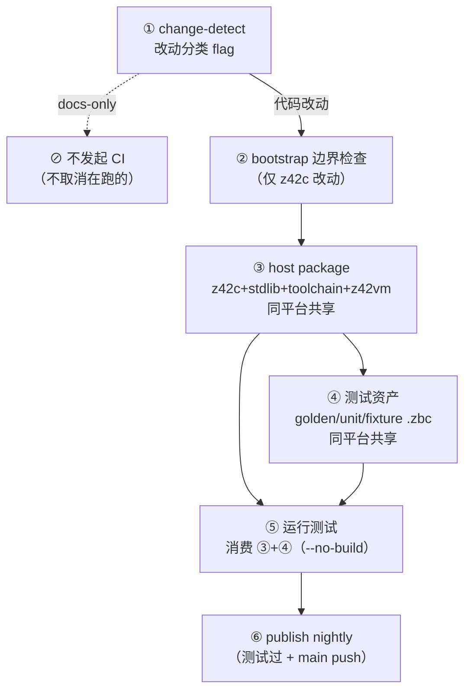

# CI 工作流

z42 CI 在 GitHub Actions 运行（[`.github/workflows/`](../../.github/workflows/)）。工具链 **100% z42 自举**：`z42c` 用 z42 写、编译为 zpkg；`z42vm` 是 Rust。

CI 与本地测试遵循**同一个 6 阶段分层流水线**——本地按阶段跑 `xtask` 即镜像 CI。深入的自举机制（SDK/Current 两套 toolchain、成对分代、不动点）见 [`testing/bootstrap.md`](testing/bootstrap.md)；本文聚焦 **CI 拓扑 + 阶段总览**。

> 🚧 **现状**：6 阶段模型是**目标拓扑**，主体已落地（change 已归档：[`docs/spec/archive/2026-06-30-compile-once-toolchain/`](../spec/archive/2026-06-30-compile-once-toolchain/)）。阶段 3/4 已产出共享 artifact（`current-sdk`），阶段 5 的部分消费者（`test-consume`）已消费；其余测试 job 仍各自自举——剩余项（test 腿全消费 / `build test-assets` / `test` 编排器）经实测低性价比延后，见 [roadmap Deferred「compile-once 正式模型 (CO-D1..D4)」](../roadmap.md)。下文标注「✅ 已落地 / 🟡 进行中 / ⬜ 目标（= CO-D 延后项）」。

---

## 6 阶段流水线



**核心思想**：平台无关的东西（zpkg、`.zbc`）**编一次、同平台共享**；只有原生件（z42vm per-arch）各平台各建。测试阶段**消费**前面编好的产物（`--no-build`），不重复编译/自举。

---

## 阶段详解

### ① change-detect
**做什么**：按改动路径分类，gate 后续阶段，避免无关改动的全量 churn。

| 规则 | 行为 | 状态 |
|------|------|------|
| (a) 非代码改动（`docs/**` / `**/*.md` / `.claude/**`）| **不触发 CI**（`on.paths-ignore`）→ 不发起、不取消在跑的 CI；`ci.yml` + `bench-update.yml` 都覆盖 | ✅ |
| (b) 未改 z42c（`src/compiler/**`）| 跳过阶段 ② 自举边界检查（`verify-selfhost` job `if: compiler`）| ✅ |
| (c) 未改 VM（`src/runtime/**`）| 跳过 Rust VM 单测（`build-and-test` Windows leg 的 `cargo test` step `if: vm`）| ✅ |
| (现有) 未改平台相关 | 跳过 wasm/ios/android/desktop 平台测试 | ✅ |

- **CI job**：`detect-changes`（`dorny/paths-filter`，输出 `platform`/`compiler`/`vm` flag；下游 job `needs: changes` + `if:` gate）。`.github/workflows/ci.yml` 进每个 filter → CI 自身改动**保底全跑**。
- **本地**：不适用（CI 专属；本地直接跑你要的 `xtask` 阶段）。

### ② bootstrap 边界检查
**做什么**：验证「**上一版已发布 nightly 的 z42c 能编译当前 z42c 源**」——守住 support-before-use 纪律（新语法/格式分两 release 引入），确保跨版本自举不断链。

- **触发**：仅 z42c（`src/compiler`）改动（rule b）。
- **CI job**：`verify-selfhost(linux-x64)`（下载上一 nightly 种子 → 重建 z42c+stdlib+xtask → 不动点 gen1==gen2 逐字节）。
- **本地**：`xtask test bootstrap [rid]`（✅ 下载上一 nightly 种子 → 用它 + 仓库 z42c 双编当前 z42c 源 → 越界即红；gh/tar 作外部子进程，逻辑在 xtask）。
- 规范：[`.claude/rules/bootstrap-seed.md`](../../.claude/rules/bootstrap-seed.md)。

### ③ host package（同平台共享）
**做什么**：把当前源码编成一套工具链 `{z42c, stdlib, toolchain}`（zpkg，平台无关）+ `z42vm`（原生，per-arch），上传供下游消费。

- **产物**：工具链 zpkg + `z42vm` 上传为 `toolchain-<os>` artifact。
- **共享性**：**zpkg 全平台共享**（编一次）；**z42vm 同平台共享**（每 host OS 一份，上传后同平台下游直接用，不重 `cargo build`）。
- **CI job**：`compile-toolchain(linux-x64 / macos-arm64)`（自举工具链）；host SDK 打包为 `package-host(<host-arch>)`。
- **本地**：`xtask build sdk [--out artifacts/.z42]`（✅ 已落地）。
- 边界：z42c+stdlib 是「成对分代」产物（gen2），发布的就是它；详见 [`testing/bootstrap.md`](testing/bootstrap.md)。

### ④ 测试资产（同平台共享）
**做什么**：把测试用的 `.zbc` **编一次**——golden（`xtask build test`）、stdlib `[Test]` 单元、fixture——`.zbc` 平台无关，全平台共享，避免每个测试 job 重复 regen。

- **产物**：golden/unit/fixture `.zbc`，bundle 进 `current-sdk-<os>` artifact（`.z42` 布局：`programs/z42c/` + `libs/` + `bin/z42vm` + `tests/`）。
- **CI job**：**`compile-test-assets(linux-x64 / macos-arm64)`** —— 独立 job（消费 ③ 的 `toolchain-<os>` + 本机 `cargo z42vm`），`regen` 一次 + `build sdk --no-build` 组装 `current-sdk`（✅ golden 已落地；unit/fixture ⬜）。**故意拆出 `compile-toolchain`**：golden regen ~9min 若留在 ③ 内会卡住 `package-*`→`publish-nightly` 关键路径（它们不消费测试资产），独立 job 并行跑、不在关键路径上。
- **本地**：`xtask build test-assets`（⬜ 目标；现为 `xtask build test`）。

### ⑤ 运行测试（消费 ③+④）
**做什么**：下载 host package + 测试资产，**`--no-build` 消费**跑测试——不再自举、不再 regen。

- **CI job**（拓扑，test-host 分解 2026-07-12：单体 gate 拆成并行管线，CI 43→23min）：
  - `test-host(<host-arch>)`（4 OS）：`test all --no-build --skip stdlib,cross-zpkg` = e2e goldens(interp)
    + compiler 自举不动点 + vscode-syntax。stdlib/cross-zpkg 两大 stage **已下放并行 job**（见下），
    每腿临界路径 ~29→~15min。
  - `test-stdlib-interp(<os>)`（linux-x64 / linux-arm64 / macos，各 2 shard）：stdlib `[Test]` interp，
    消费 toolchain 工件（`.zpkg` 平台无关 + cargo 本机 z42vm）。**每慢 OS 各自分片** → host-dependent
    stdlib（io/net/process/fs）保持本平台覆盖。
  - `test-stdlib-jit(linux-x64)`（4 shard）：stdlib `[Test]` jit。
  - `test-vm-jit(linux-x64)`（4 shard）：VM goldens **jit**（仅 goldens；cranelift 逐 case 编译慢 → 分片）。
  - `test-cross-zpkg(linux-x64)`：cross-zpkg **interp + jit**（多包字节码派发 host-independent，单腿覆盖两模式）。
  - `verify-selfhost` / `package-host(<host-arch>)` / `package-{android,ios,wasm}` / `test-{ios-sim,android-emu,...}`。
  - 上述 stdlib-interp / stdlib-jit / vm-jit / cross-zpkg / package 腿均 `needs: toolchain-bootstrap`，
    消费其一次构建的 `toolchain-<os>` 工件（去 8× 重复引导 + nightly 漂移 flake）。
- **本地**：`xtask test [--toolchain <sdk>] [--no-build]` = 完整单体 gate（不分片；stage 组成见
  [test-gate.md](../../book/src/dev/test-gate.md)）。CI 的 `--skip` 分解只为并行，本地始终整跑。
- 约束（先简化后修）：① `test-runner` 是 native，暂保留——`xtask test` 接口不变，内部后续换 `z42.build`；② release-vm-jit 有 bug（见 [memory](../../.claude/projects)），jit 跑 debug vm 或延后。

### ⑥ publish nightly
**做什么**：测试通过 → main push → 发布 nightly（下一轮自举的种子）。

- **CI job**：`publish-nightly`（`needs: build-and-test + host-package + package-*`）。
- **防死锁**：**故意不** gate 在 download-bootstrap job（`test-vm-jit(linux-x64)` / `test-stdlib-jit(linux-x64)` / `verify-selfhost`）上——它们在 zbc/zpkg 格式 bump 那轮会暂时失败（要等兼容 nightly），gate 上去会死锁、无逃生口。「行为正确」由 `build-and-test`（在 needs 里）保证。

---

## CI job → 阶段映射

| 阶段 | CI job（display 名）| 矩阵 |
|------|--------------|------|
| ① | `detect-changes` | — |
| ② | `verify-selfhost(linux-x64)` | linux |
| ③ | `compile-toolchain(<host-arch>)` / `package-host(<host-arch>)` | linux-x64, macos-arm64（pkg 含 +arm64/+windows）|
| ④ | `compile-test-assets(<host-arch>)`（独立 job：regen + bundle 进 current-sdk）| linux-x64, macos-arm64 |
| ⑤ | `test-host(<host-arch>)` / `test-vm-jit(linux-x64)` / `test-stdlib-jit(linux-x64)` / `test-consume(linux-x64)` / `verify-features(linux-x64)` / `test-{wasm-browser,ios-sim,android-emu,desktop-cabi}(<host-arch>)` / `package-{ios,android,wasm}(<host-arch>)` | 见各 job |
| ⑥ | `publish-nightly` | linux |

> **job 命名约定**：`<动作>-<目标>[-<scope>](<host-arch>)`。**每个 job 都带目标**（含通用 host gate → `host`），命名统一无例外。
> - `<动作>`：detect / compile / package / test / verify / bench / publish。
> - `<目标>`：被作用的平台 / 组件（host / toolchain / test-assets / ios / android / wasm / desktop / vm / stdlib / compiler / consume / selfhost / features…）。`host` = 跑在 host 平台上的「全量 test gate / host SDK package」。
> - `<scope>`（测试范畴，**有则加，无则省**）：jit / browser / sim / emu / cabi / stdlib / smoke…
> - `(<host-arch>)`：跑该 job 的 host 平台+架构（linux-x64 / linux-arm64 / macos-arm64 / windows-x64）。
> 例：`compile-toolchain(linux-x64)`、`compile-test-assets(macos-arm64)`、`test-host(linux-arm64)`、`test-vm-jit(linux-x64)`、`package-host(windows-x64)`、`package-android(linux-x64)`。
> 仅改 display `name:`（job key 不变 → `needs:` 不受影响）；**branch protection 的 required checks 需按新 display 名更新**。

---

## GREEN 标准

任何 commit / PR merge 前必须全绿（[`.claude/rules/workflow.md`](../../.claude/rules/workflow.md) 阶段 8）。统一入口：

```bash
./xtask test          # 默认串联全 stage（完整 GREEN gate）
```

裸 `test` 先跑 regen 构建波（stdlib + z42c 自建 + golden `.zbc` 基线 + debug VM；`--no-build`
可跳过），随后按序串联全部必跑 stage（任一失败立刻停）。**stage 组成（唯一权威清单）见
[test-gate.md](../../book/src/dev/test-gate.md)**——此处不再复列，避免多处漂移（§4.4）。要点：
e2e goldens(interp) + cross-zpkg + stdlib + compiler 自举 + vscode-syntax；Rust VM 单测
（`test runtime`）**不在** gate 内（信号沙箱会挂），每条 CI 腿单独一步。

> 编译器正确性由 `test compiler`（z42c 自举不动点）保证。
> 任何测试失败（含 pre-existing）都不得 commit / push。

---

## 本地镜像 CI（按阶段跑）

6 阶段模型的价值：本地可以**按阶段跑、缓存昂贵的前段**，不必每次 `xtask test` 都重头编：

```bash
xtask build sdk          # 阶段③：编一次 host package → artifacts/.z42（缓存）
xtask build test-assets  # 阶段④：编一次测试资产（⬜ 目标命令）
xtask test --no-build    # 阶段⑤：消费③+④，反复迭代测试时不重编
```

> 目标：`xtask test`（无参）= 编排器，检测③④产物在否，缺则补、在则默认 `--no-build` 消费。

---

## 多平台 CI matrix

`test-host(<host-arch>)` 在 4-OS matrix 跑：`linux-x64`（ubuntu-latest）/ `linux-arm64`（ubuntu-24.04-arm）/ `macos-arm64`（macos-15）/ `windows-x64`（windows-latest）。平台支持矩阵设计见 [`docs/design/runtime/cross-platform.md`](../design/runtime/cross-platform.md)。

## Release 自动化

git tag → 跨平台 binary 自动产出。详见 [`release.md`](release.md)。nightly 由 `publish-nightly`（阶段⑥）滚动发布。
