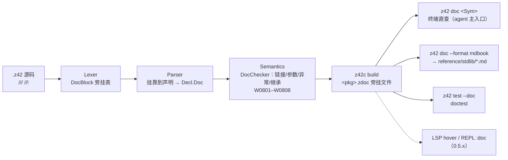

# z42-doc 设计与推进底稿

> 临时迭代底稿（[doc-system.md](agent/rules/doc-system.md) §1）：一轮多 PR 迭代的设计、决策与进度。
> 迭代完成后：语法规则上浮 `reference/src/language/doc-comments.md`，工具用法上浮
> `reference/src/toolchain/`，实现机制上浮 `internals/src/toolchain/doc.md`，写法约束进
> `agent/rules/doc-comments.md`，然后删除本文件。

## 0. 要解决的问题

| 现状 | 证据 | 代价 |
|---|---|---|
| 同一个 API 写三遍 | `Random.z42` 的 `///` + `z42.random/README.md`「入口点」签名清单 + `reference/stdlib/random.md` | 每次改 API 要改三处；三处必然漂移 |
| 没有任何东西比对源码签名与 reference 页 | `xtask test docs` 只查死链；`diagcodes` 只管错误码 | 漂移只能靠人工 |
| `///` 没有格式约定 | 2.5k 行 `///`，纯散文，中英混杂；`String.z42`、`Stack.z42` 等用 `//` 写 API 说明 | 机器无法提取参数 / 异常 / 示例 |
| `///` 里混着历史注记与实现笔记 | `/// extend-z42-random (2026-06-03): ...` | 违反 doc-system §6「不写历史」；agent 读到大量无效 token |
| 编译器丢弃全部注释 | `Lexer.z42:121` `_skipTrivia` | 没有提取、校验、发布的基础 |
| agent 查一个 API 要读整个源文件 | 没有符号索引 / LSP；`String.z42` 398 行只为查一个签名 | token 消耗与 API 面积成正比 |

**目标（按优先级）**

1. **单一事实源**：公开 API 的说明只写在源码 `///` 里；reference 的 stdlib 页、包 README 的入口清单都由工具生成或改成链接。
2. **注释可校验**：参数名、符号链接、异常类型、示例代码都由编译器检查，错了就报警告。
3. **agent 低成本导航**：`z42 doc <符号>` 一条命令拿到签名、摘要、`file:line`；`--members` 拿到一个类型的完整轮廓，不必读源文件。
4. **增量迁移**：现有 2.5k 行散文 `///` 不改也能解析；按包逐步迁移，靠 ratchet 基线防倒退。

**不做**：HTML 站点主题（沿用 mdBook）；跨包「查找所有引用」（归 LSP，0.5.7）；Rust 运行时的 rustdoc（VM 内部不变）。

## 1. 各语言取舍

| 来源 | 借鉴 | 不借鉴 |
|---|---|---|
| **Rust** rustdoc | `///` 外部注释 + `//!` 内部注释；正文是 Markdown；首段即摘要；intra-doc 链接 ``[`Sym`]`` 按作用域解析；doctest；`missing_docs` / `broken_intra_doc_links` lint；`--document-private-items` | `# Errors` 这类 Markdown 标题分节（每节多两行，token 偏多） |
| **C#** XML doc | **编译器校验**参数名（CS1572/1573）；文档**旁挂文件**随程序集分发（`.xml` → IntelliSense）；稳定的 **Doc ID**（`M:Ns.T.M(System.String)`）；`<inheritdoc/>` | XML 标签本身（同样信息约多 3～5 倍 token） |
| **Go** godoc | `go doc pkg.Sym` 终端直查，输出极简——这是给 agent 用的最佳形态；摘要一句话 | 摘要必须以名字开头（中文语序不适用） |
| **Javadoc / KDoc / TSDoc** | 单行 `@tag`：每条一行、无需 Markdown 解析即可提取，所有 LLM 都熟 | 必填的样板 tag（`@param x the x`） |
| **Zig** | doc 注释是语法的一部分：**挂错位置直接报**（孤立 doc 注释） | 直接报错（这里降为警告，便于迁移） |
| **Elixir** | 文档进编译产物、REPL 里 `h Mod.fun` 直查；doctest 比较的是**输出文本** | 把文档塞进运行时产物（这里改用旁挂文件，不动 zpkg 版本） |
| **API Extractor** (TS) / `cargo public-api` | 生成的 API 面**提交进仓库**，PR diff 里直接看见 API 变化；CI 重新生成比对 | 单独的 `.api.md` 文件（生成的 reference 页同时承担这个角色，不另起一份） |
| **Swift DocC / Sphinx** | 文档按 ID 外挂翻译层 | 独立的文档目录（文档留在源码旁） |

## 2. 注释语法（用户可见，将上浮 reference）

### 2.1 三种注释

| 写法 | 作用对象 | 用途 |
|---|---|---|
| `///` | 紧随其后的声明 | API 文档：给**调用者**看——做什么、契约、例外、示例 |
| `//!` | 所在文件的 `namespace`（写在 `namespace X;` 之前） | 命名空间 / 包的概述：页头简介、注意事项 |
| `//`、`/* */` | 无 | 实现笔记：给**维护者**看——为什么这样实现、踩过的坑 |

挂靠规则：

- `///` 块与声明之间只允许空白和属性（`[Native(...)]`、`[Deprecated]` 等）。约定写法是 **doc 在前、属性在后**，`z42 fmt` 落地后自动归一。
- `///` 后面不是声明（例如在方法体里，或者后面空了一行再接 `//`）时报 **W0801 孤立 doc 注释**。这条规则会迫使现有「`///` 写实现笔记」的用法改回 `//`。
- 同一个命名空间只能有一个文件写 `//!`（违反报 W0808）。约定放在包的主文件里，例如 `Random.z42`。

### 2.2 块结构

```
/// 摘要：一句话，句号结束。          ← 首段。用于索引、outline、hover，超过 80 个字报 W0807
///
/// 正文：Markdown（CommonMark 子集）。可多段、可列表、可 `代码`、可 > ⚠️ 提示。
///
/// @param   名字  说明                  ← 以下 tag 区：每个 tag 从行首 @ 开始，
/// @typeparam T   说明                     续行缩进 ≥2 空格
/// @returns 说明
/// @throws  类型  何时抛出
/// @see     [`符号`]
/// @warning 说明                         ← 渲染为醒目提示（线程安全、非 CSPRNG 之类）
/// @example [no_run|compile_fail|ignore]
///     代码（缩进 4 格）
/// @hidden                               ← public 但不进文档（跨包用的内部入口）
```

**tag 是闭集**，只有上面 8 个；写了未知 tag 报 W0804。不设 `@deprecated`：弃用只用现有的
`[Deprecated("msg")]` 属性表达，生成器读属性渲染（同一事实只出现在一个地方）。不设 `@since`：
不写历史。

**全部 tag 都是可选的。** 不要求每个参数都写 `@param`，只为签名表达不了的东西写：取值范围、单位、
所有权、边界行为。写了就会校验：`@param` 名必须是真实存在的形参（W0802），`@throws` 后的类型必须能解析
（W0803）。

### 2.3 符号链接

- 链接写法只有两种：``[`Sym`]`` 和 ``[文字](`Sym`)``。**不带反引号的 `[...]` 一律当普通文本**，所以
  `[0.0, 1.0)` 这种区间写法不会误判成链接。
- 解析顺序与代码里的名字查找一致：当前声明 → 所在类型的成员 → 当前命名空间 → 本文件的 `using` → 全限定名。
- 方法有重载时用参数表消歧：``[`PadLeft(string, int, char)`]``。只有一个候选时可以省略参数表。
- 解析失败报 W0803。解析成功后，`.zdoc` 里记录目标的 Doc ID，渲染成跨页锚点。

### 2.4 Doc ID（全工具链共用的符号身份）

```
类型        Std.Random.Random
嵌套类型    Std.Json.JsonValue+Kind               （与现有 Outer+Inner 扁平化一致）
泛型类型    Std.Collections.List<T>
方法        Std.Text.Strings.PadLeft(string,int,char)
泛型方法    Std.Json.Json.Deserialize<T>(string)
构造器      Std.Random.Random.ctor(long,long)
属性/字段   Std.Core.String.Length
索引器      Std.Collections.List<T>.this[int]
枚举成员    Std.IO.FileMode.Append
命名空间    Std.Random
```

规则：参数类型写声明时的类型名，非内建类型写全限定名；不含参数名、不含返回类型。Doc ID 是 `.zdoc`
的主键、mdBook 锚点的来源（slug 化）、`z42 doc` 的查询键，将来也是 LSP hover 和翻译层的键。

### 2.5 示例即测试（doctest）

```z42
/// @example
///     var r = new Random(42);
///     r.NextIntRange(5, 6)             // => 5
///     Strings.PadLeft("42", 5, '0')    // => 00042
```

- 每个 `@example` 编译成一个独立的测试函数，`TestEntryKind.Doctest = 5` 已经在 `IrModule.z42:465`
  和 `test_index.rs:80` 预留好了。
- 一行 `expr // => text` 的含义是断言 `expr.ToString() == "text"`。这借鉴 Elixir：比较的是输出文本，
  不需要 `Assert.Equal` 样板，也正好沿用了现有注释里 `→` 的写法习惯。
- 模式：默认编译并运行；`no_run` 只编译；`compile_fail` 期望编译失败；`ignore` 两者都不做。
- 用 `z42 test --doc` 跑，并入 stdlib 的 GREEN gate。

### 2.6 继承

`override` 方法和接口实现方法如果没有 `///`，**自动继承**基类或接口的文档（rustdoc 处理 trait impl
的方式）。不需要写 `@inheritdoc`，也禁止复制粘贴文档：两份内容相同的文档就是漂移源。自己写了 `///`
则以自己的为准。

### 2.7 完整样例（以 `Random` 为例迁移后）

```z42
//! 确定性伪随机数：给同一个 seed 得到同一串数。
//!
//! 适合测试 fixture、模拟、洗牌、临时 ID、UI 抖动。
//!
//! @warning **不是 CSPRNG**——观察少量输出即可反推内部状态。安全场景用 [`Std.Crypto.SecureRandom`]。
//! @warning **非线程安全**。多线程请每线程一个实例，并用不同 `streamId` 保证序列不重叠。
namespace Std.Random;

/// PCG-XSH-RR 伪随机数发生器。
public class Random {
    /// 用墙钟时间作 seed。每次运行结果不同，**不可复现**。
    public Random() { ... }

    /// 固定 seed：相同 seed ⇒ 逐位相同的序列。
    public Random(long seed) { ... }

    /// 固定 seed 并选一条独立的流。
    ///
    /// seed 相同、`streamId` 不同的两个实例，产生的序列互不重叠。
    /// @param streamId 内部取 `streamId | 1` 作为 PCG 增量
    public Random(long seed, long streamId) { ... }

    /// 返回 `[min, max)` 内的整数。
    ///
    /// 用取模映射，不做 rejection sampling：span 不整除 2³² 时存在微小偏差。
    /// @throws ArgumentException `max <= min`
    /// @example
    ///     new Random(42).NextIntRange(5, 6)    // => 5
    public int NextIntRange(int min, int max) { ... }
}
```

原来的 `// add-z42-random (2026-05-15)`、`/// extend-z42-random (2026-06-03): ...` 删除（历史归
git blame）。算法常量的来源说明保留，但改成方法体里的 `//`。

## 3. 写法约束（将上浮 `agent/rules/doc-comments.md`）——同时是省 token 的关键

1. **`///` 只写调用者需要的**：契约、边界、例外、示例。「怎么实现、为什么」写 `//`，放进方法体。
2. **摘要一句话，动词开头**：「返回…」「把…写入…」。不复述类型名和方法名。
3. **不写签名已经表达的**：`@param seed 种子` 这种写了等于没写。
4. **不写历史**：日期、spec 名、「原来是…」一律不写。W0806 会机械拦截 `(20xx-xx-xx)` 和 `add-xxx:` 这类模式。
5. **能链接就不复述**：要说明「见 PadLeft 的规则」就写 ``[`PadLeft`]``，不要抄一遍。
6. **覆盖范围**：stdlib 的 `public` 声明必须有 `///`（W0805，ratchet）。编译器和工具链内部代码在契约不显然时写 `///`，`z42 doc --private` 能直接查到。
7. **语种**：见 §9 决策 D1。

## 4. 架构



### 4.1 词法与语法（`z42c.syntax`）

- `Lexer._skipTrivia`：遇到 `///` 或 `//!` 时，**不改 token 流**，而是把连续的行收进
  `List<DocBlock>`（`{Kind: Outer|Inner, Lines, Span}`）。这和现有 `#suppress` 区间挂在
  `CompilationUnit` 上的做法相同（`Decl.z42:421-440`）。词法器只做收集，表达式解析器完全不受影响。
- `////`（四个及以上斜杠）按普通注释处理，与 Rust 相同，方便写分隔线。
- 解析器在开始解析一个声明时（`AttributedDecl` 包装处，以及 `FieldDecl`、`MethodDecl`、`PropertyDecl`、
  `ClassDecl`、`EnumDecl`、`EnumMember`、`DelegateDecl`、`IndexerDecl`），取「紧邻在前、中间只有空白和属性」
  的那个 DocBlock，挂到 `Decl.Doc`。只保存原文和 Span，**不在这里解析 Markdown 或 tag**，编译热路径几乎零成本。
- 解析结束后仍未被认领的 DocBlock 报 W0801。
- `--dump-doc` 调试开关：打印每个声明挂到的 DocBlock，用于测试。

### 4.2 文档模型与校验（新包 `z42.doc` + `z42c.semantics` 一个 pass）

`src/compiler/z42.doc/`（编译器域库，z42c 与 z42d 都依赖它）：

| 文件 | 职责 |
|---|---|
| `DocParser.z42` | 原文 → `DocComment{Summary, Body, Tags[], Links[], Examples[]}`。只识别 tag 区和链接，正文 Markdown 原样保留，不在这里渲染 |
| `DocId.z42` | 由符号生成 Doc ID；解析 Doc ID 或短名 |
| `ZdocModel.z42` / `ZdocWriter.z42` / `ZdocReader.z42` | `.zdoc` 读写 |

`z42c.semantics/src/Docs/DocChecker.z42`：放在绑定完成之后、代码生成之前。**只在需要时运行**，即
`[doc] emit = true`（库默认开启）或 `z42 doc`、`z42 test --doc` 驱动时。职责：

- 用声明所在的作用域解析 ``[`Sym`]`` 和 `@throws` 类型（复用 binder 的名字查找）；
- 校验 `@param`、`@typeparam` 名；
- 计算继承文档（§2.6）、基类与接口、**反向的实现者列表**（rustdoc 的 Implementors，跨包时在 z42 doc 侧汇总）；
- 跑 W0804～W0807 的格式类 lint。

### 4.3 `.zdoc` 旁挂文件

为什么不新增 zpkg section：zbc/zpkg 是 strict-pin 版本，新增 section 要 minor bump，Rust 和 z42 两侧
reader 都得改（`zbc.md:286-292`）。`.zsym` 已经开了「旁挂文件」的先例。文档本来就不是运行时数据，
发布时也应该能整个丢掉。

- 位置：与 `<pkg>.zpkg` 同目录，命名 `<pkg>.zdoc`。
- SDK 打包：stdlib 的 `.zdoc` 进 `packages.toml` 新组件 `[component.docs]`。装了 SDK 就能 `z42 doc Std.xxx`。
- 格式：**JSON，带 `format` 版本号**。理由：给工具和 agent 用，可读可 `jq`；体积不敏感（stdlib 全量预计几百 KB）。

```json
{
  "format": 1,
  "package": "z42.random",
  "version": "0.4.0",
  "namespaces": [
    { "id": "Std.Random", "summary": "确定性伪随机数：给同一个 seed 得到同一串数。",
      "body": "...", "warnings": ["**不是 CSPRNG**——..."], "loc": "src/Random.z42:1" }
  ],
  "items": [
    {
      "id": "Std.Random.Random.NextIntRange(int,int)",
      "kind": "method",
      "parent": "Std.Random.Random",
      "sig": "public int NextIntRange(int min, int max)",
      "loc": "src/Random.z42:112",
      "summary": "返回 `[min, max)` 内的整数。",
      "body": "用取模映射，不做 rejection sampling：...",
      "params": { },
      "throws": [ { "type": "Std.ArgumentException", "when": "`max <= min`" } ],
      "examples": [ { "mode": "run", "code": "new Random(42).NextIntRange(5, 6)    // => 5" } ],
      "links": { },
      "attrs": [ ],
      "docFrom": null,
      "bases": [ ], "implements": [ ]
    }
  ]
}
```

`sig` 存渲染好的签名字符串，这是 agent 最需要的字段，也免得每个消费者各自拼一遍。`loc` 相对包根，
`z42 doc` 输出时转换成相对仓库根的路径。私有成员只有在 `[doc] private = true` 时才写入。

### 4.4 `z42 doc`（`z42d doc`，launcher 转发）

现状：`devtools_cli.z42:43-45` 已经登记了 `doc`，但只打印 "planned"；launcher 还没有转发到 z42d 的通道。
需要补一个 `_forwardZ42d`，写法对照 `_forwardZ42b`。

**查询模式（agent 主入口，输出刻意极简）**

```console
$ z42 doc Random.NextIntRange
public int NextIntRange(int min, int max)          Std.Random.Random
  返回 `[min, max)` 内的整数。
  用取模映射，不做 rejection sampling：span 不整除 2³² 时存在微小偏差。
  throws ArgumentException  `max <= min`
  @ src/libraries/z42.random/src/Random.z42:112

$ z42 doc Random --members              # 类型轮廓：每成员一行
class Std.Random.Random                             src/libraries/z42.random/src/Random.z42:12
  PCG-XSH-RR 伪随机数发生器。
  ctor()                                   用墙钟时间作 seed。                   :20
  ctor(long seed)                          固定 seed：相同 seed ⇒ 逐位相同的序列。 :26
  long NextLong()                          …                                    :70
  int  NextIntRange(int min, int max)      返回 `[min, max)` 内的整数。          :112
  ...

$ z42 doc --search "shuffle"            # 名字 + 摘要模糊搜索，每条一行
$ z42 doc Std.Random                     # 命名空间：概述 + 类型列表
$ z42 doc --impls Std.Collections.IEnumerable<T>   # 实现者
$ z42 doc ... --json                     # 原样输出 .zdoc 条目
$ z42 doc --private --pkg z42c.semantics TypeChecker --members   # 编译器内部
```

- 名字解析：先精确匹配 Doc ID，再匹配后缀（`Random.NextIntRange`），再做模糊匹配。多个命中时列出候选（每个一行），不报错。
- 数据来源：SDK 内的 stdlib `.zdoc`，加上当前工程 `artifacts/` 下各包的 `.zdoc`。数据过期时，提示运行 `z42 build`。
- **省 token 估算**：查 `Random` 的完整 API，原来要读 257 行源码（约 3k token），`--members` 只有约 25 行（约 400 token）；查单个成员大约 5 行。拿到 `file:line` 之后，按 offset/limit 精确读实现即可。

**生成模式**

```console
$ z42 doc --format mdbook --out docs/reference/src/stdlib   # 生成 reference 包页
$ z42 doc --format md --out <dir>                            # 普通工程用
```

### 4.5 reference 包页：从手写改为生成

- 仍然**一包一页**（`docs/reference/src/stdlib/<pkg>.md`），文件名不变，SUMMARY 和现有链接都不受影响。
  特别大的包（如 `z42.core`）可以设置 `[doc] split = "type"`，改为一个类型一页。
- 页面结构（满足 `book-writing.md:94-100` 的「概述 / 约定 / 逐项条目」骨架）：
  1. 标题 = 包名 —— 命名空间 `//!` 的摘要；
  2. `> 包路径 …；命名空间 …`（自动生成）+ `//!` 正文 + `@warning` 提示框；
  3. 每个类型一个 `##`：类型文档，加一个 ```` ```z42 ```` 签名总览块（保留现有页面的这种写法，也方便 grep）；
  4. 每个成员一个 `###`：签名、正文、参数表（只有写了 `@param` 的才列）、异常、示例。锚点 = Doc ID slug；
  5. `[Deprecated]` 成员标注删除线和弃用说明，`@hidden` 不输出。
- 页首写 `<!-- 由 z42 doc 生成，勿手改。源：src/libraries/z42.random/ -->`。
- **生成的页面提交进仓库**（决策 D3）。好处：mdBook 部署流程不用改；PR diff 里直接看到 API 和文档的变化，起到 API Extractor 的作用；agent 也能直接 grep。
- `stdlib/README.md` 的「包 → 页 → 类型」索引也改为生成。
- 包 README 的「入口点」签名清单删除，改成一行链接到 reference 包页（`readme-writing.md:177` 本来就是这么要求的）。

### 4.6 门禁

| 门 | 内容 | 对照的现有先例 |
|---|---|---|
| `xtask doc gen` | 编译 stdlib，重新生成 reference 包页 | `xtask deps install vscode` 重新生成 grammar |
| `xtask check docs-api` | 重新生成并与仓库内文件 diff，不一致即失败，并提示运行 `xtask doc gen` | `xtask check vscode-syntax` |
| `xtask check doc-lints` | stdlib 的 W08xx 计数不得超过 `scripts/test/doc-lint-baseline.txt` 里的基线（ratchet，只降不升） | `doc-link-baseline.txt`、`diag-untested-codes.txt` |
| `z42 test --doc` | stdlib 的 doctest 并入 GREEN gate | learn ↔ examples 重放 |
| CI `docs-check` job | 纯文档 PR 也跑 `check docs-api` | `ci.yml:196-222` |

改完之后，doc-system 三问的第 1 问对 stdlib 来说变成：**改 `///`，然后运行 `xtask doc gen`**。漏掉了门禁会拦下来，不再依赖人工记得。

### 4.7 诊断码（W08xx，当前空闲）

| 码 | 含义 | 默认级别（用户工程 / stdlib） |
|---|---|---|
| W0801 | 孤立的 `///`，后面没有声明 | warn / warn |
| W0802 | `@param` / `@typeparam` 名不存在 | warn / error |
| W0803 | 文档链接或 `@throws` 类型无法解析 | warn / error |
| W0804 | 未知 tag，或 tag 格式错误 | warn / error |
| W0805 | `public` 声明缺少 `///` | allow / warn（ratchet） |
| W0806 | 文档里出现历史注记（日期、spec 名） | allow / error |
| W0807 | 摘要缺失或超长（>80 字） | allow / warn |
| W0808 | 同一命名空间有多个文件写了 `//!` | warn / error |

级别通过 `[lints]` 调整（`ManifestLoader.z42:102-135` 的现有机制）。stdlib 的默认级别在 stdlib 工作区
的 toml 里统一设置。新增码按现有四步走：注册表、发出点、`error-codes.md` 行、断言测试，
由 `xtask check diagcodes` 双向守护。

### 4.8 `z42.toml` 的 `[doc]` 表

```toml
[doc]
emit    = true        # 库默认 true，exe 默认 false：build 时产出 .zdoc
private = false       # 是否收录非 public 成员（编译器各包设为 true，供 agent 查询）
split   = "package"   # mdbook 输出粒度："package" | "type"
```

解析写法照 `_parseSyntax` / `_parseLints`：加一个 `_parseDoc` 填充函数，再给 `ProjectManifest` 加字段。
同步更新 `reference/toolchain/z42-toml.md` 和 `manifest-schema.json`。

## 5. agent 工作流改造（省 token 的落地点）

1. 在 `docs/agent/rules/code-organization.md` 的「先读 README 再读代码」之后加一步：
   **查符号先用 `z42 doc <Sym>` 或 `--members`，再按返回的 `file:line` 用 offset/limit 读实现**，不要整文件读取。
2. 新增 `.claude/skills/z42-doc/`：一个很薄的 skill，写清查询命令的速查表和「改 API 后运行 `xtask doc gen`」的流程。
3. 编译器各包设置 `[doc] private = true`。之后 agent 改编译器时，可以用 `z42 doc --private --pkg z42c.semantics Binder --members`
   拿到内部类的轮廓。这对 1.8 万行 `//` 的编译器帮助最大。
4. `z42 doc --search` 补上「不知道叫什么名字」的场景：按摘要搜，比 grep 源码噪声小得多。

## 6. 现有注释迁移

| 类别 | 处理 |
|---|---|
| 散文式 `///`（多数） | 不改也能解析：首段成为摘要，其余成为正文。之后按包补 tag |
| `///` 里的历史注记 | 删除（W0806 定位） |
| `///` 写的实现笔记 | 改为 `//`，移进方法体（W0801 + 人工判断） |
| 用 `//` 写的 API 说明（`String.z42`、`Stack.z42` 等） | 改为 `///` |
| reference 页里手写的内容 | 契约、警告、示例回填到源码 `///` / `//!` 后，删除手写页，改为生成 |
| 包 README「入口点」 | 改为一行链接 |
| `[Native]` extern 声明 | 文档写在 z42 侧的声明上，Rust 侧 `builtin_*` 的 rustdoc 不变 |

迁移顺序：先拿 `z42.random`（小、已有现成的手写页可以对照）做试点，然后 `z42.text`、`z42.json`。
接着批量迁移剩下的 26 个包：一个包一个 PR，各包互相独立，可以多个 agent 并行。最后是 `z42.core`（最大，使用 `split = "type"`）。

## 7. 阶段计划

每个阶段 = 一个或几个 PR，合并时都是 GREEN。**P3（查询）排在 P4（生成）之前**：先让 agent 省到 token，再解决文档重复写的问题。

| 阶段 | 内容 | 退出标准 |
|---|---|---|
| **P0 规范** | reference `language/doc-comments.md`（§2 的语法）；`agent/rules/doc-comments.md`（§3 的写法约束）；裁定 §9 的决策 | 两页合并 |
| **P1 挂靠** | Lexer DocBlock 旁挂表、Parser 挂靠、`Decl.Doc`、`--dump-doc`、W0801/W0808 | 编译器测试覆盖各种声明的挂靠和孤立块；stdlib 的 W0801 计数进 baseline |
| **P2 模型与校验** | `z42.doc` 包（DocParser / DocId / Zdoc）、`DocChecker`、W0802～W0807、`[doc]` 表 | 诊断测试齐全；`diagcodes` 绿 |
| **P3 产出与查询** | build 时产出 `.zdoc`；SDK `[component.docs]`；`z42d doc` 的查询模式；launcher 转发；agent 规则和 skill | `z42 doc Std.Random.Random --members` 在 SDK 安装环境下可用；编译器包可以 `--private` 查询 |
| **P4 生成与门禁** | mdbook 渲染器；`xtask doc gen`；`check docs-api`、`check doc-lints`；`z42.random` 试点替换手写页 | random 页改为生成，`check docs-api` 进 GREEN gate |
| **P5 批量迁移** | 剩余包逐个迁移；README 入口点改为链接；W0805 ratchet 逐步降到 0 | stdlib 的 reference 页全部由生成得到 |
| **P6 doctest** | `@example` 编译成 `TestEntryKind.Doctest`；`z42 test --doc` 进 gate | stdlib 示例全部可运行 |
| **P7 延伸** | REPL `:doc`；LSP hover 复用 `.zdoc`（0.5.7）；英文翻译层（按 Doc ID 叠加，见 D1） | 按 roadmap 排期 |

P1～P3 完成，就满足 roadmap 0.4.6 的「`z42-doc` 无错」要求。

## 8. 风险

| 风险 | 对策 |
|---|---|
| 解析器挂靠改动触及所有声明路径 | DocBlock 走旁挂表、不进 token 流，解析器只在声明入口按 Span 认领；回归靠全量编译器测试 |
| 生成的页面和手写页面风格不一致 | 试点阶段并排对比 random 页，调好渲染器再批量迁移 |
| 生成页提交进仓库，PR 可能冲突 | 一包一文件，冲突面只限同一个包；冲突时重新运行 `xtask doc gen` 即可解决 |
| doctest 拖慢 gate | 按包增量运行（复用 `xtask test changed` 的影响面判定） |
| `.zdoc` 格式演进 | 自带 `format` 版本号；读取方拒绝更高版本并提示升级 SDK |

## 9. 待裁决

| # | 问题 | 推荐 | 理由 |
|---|---|---|---|
| **D1** | doc 注释用什么语言 | **中文**（标识符和代码保持英文）；英文版后续按 Doc ID 加翻译层 | reference 书规定中文先行（doc-system §2）；如果源码用英文，生成的 reference 就会是英文，或者还得手工翻译，又回到写两遍 |
| **D2** | 结构化信息的写法 | **单行 `@tag`**（§2.2） | 比 Rust 的 Markdown 分节省行数，比 XML 省 3～5 倍 token，解析也最简单 |
| **D3** | 生成的 reference 页是否提交 | **提交**，加 drift 门禁 | mdBook 部署不用改；PR 里能直接看到 API diff；agent 能 grep |
| **D4** | 文档放哪里 | **`.zdoc` 旁挂文件** | 避免 zpkg 版本 bump，运行时部署可以丢掉 |
| **D5** | `public` 缺文档的处理 | stdlib 设为 warn + ratchet，用户工程默认 allow | 允许渐进迁移，同时不倒退 |
